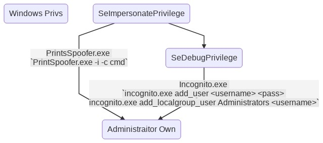

# writeups
Writeups for some stuffs


#### Windows PrivEsc

- Mostly abused Permissions on windows

```bash
SeImpersonatePrivilege
SeAssignPrimaryPrivilege
SeTcbPrivilege
SeBackupPrivilege
SeRestorePrivilege
SeCreateTokenPrivilege
SeLoadDriverPrivilege
SeTakeOwnershipPrivilege
SeDebugPrivilege
```

- More at [GHDB](https://www.exploit-db.com/papers/42556)

<p align="centre">
    
</p>


- If Applocker is enabled, we can bypass it by placing the binaries in `C:\Windows\System32\spool\drivers\color`
- ~/.bash_history for powershell `%userprofile%\AppData\Roaming\Microsoft\Windows\PowerShell\PSReadline\ConsoleHost_history.txt`
