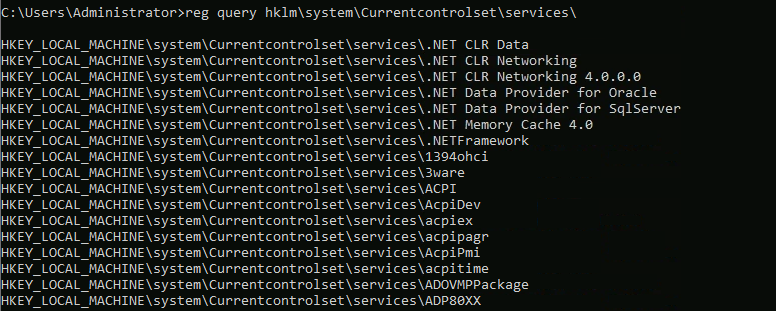

# Core Windows Processes

## Task Manager

- Task manager shows the running application in the system
- To get a detailed view, the **More Option** in the task manager is used

<p align="center">
  
</p>

- In the detailed view, we get to know some more information about the processes that are running in the system are obtained
- Normally a process falls under three categories
  - Apps
  - Background Process and
  - Windows Processes


 Apps and Background process | Windows process
:----------------------------:|:---------------:
  | 


- Some useful columns that will aid us in investigating are **Process Name** and **Command Line**
- Understanding the available options in the task-manager will aid us in crisis

<p align="center">

</p>

- Type - Each process falls into 1 of 3 categories (Apps, Background process, or Windows process).
- Publisher - Think of this column as the name of the author of the program/file.
- PID - This is known as the process identifier number. Windows assigns a unique process identifier each time a program starts. If the same program has multiple processes running, each will have its own unique process identifier (PID).
- Process name - This is the file name of the process. In the above image, the file name for Task Manager is Taskmrg.exe
- Command line - The full command used to launch the process.
- CPU - The amount of CPU (processing power) used by the process.
- Memory - The amount of physical working memory utilized by the process.
- On the details section of taskmanager, shows the core process of the system
- Sorting out the PID's gives us a clear understanding of which processes are started first
- Including some extra columns such as **Command Line** and **Image Path Name** will be helpful for further investigating

<p align="center">
  
  <br /><br />
  
</p>

- Task Manager is powerful, but when investigating it lacks some functionalities like showing the parent process of the host application, that's where applications like [Process Hacker](https://processhacker.sourceforge.io/) and [Process Explorer](https://docs.microsoft.com/en-us/sysinternals/downloads/process-explorer) kicks in

```bash
# command for enumerating tasks from the powershell / cmd
ps
tasklist
Get-Process
wmic
# inside wmic shell = process
```

## System

- The top process in the details tabs is the **system** process, althought the **PID's** for applications are assigned in a random manner, the PID (process ID) for system is always 4

> The System process (process ID 4) is the home for a special kind of thread that runs only in kernel mode a kernel-mode system thread. System threads have all the attributes and contexts of regular user-mode threads (such as a hardware context, priority, and so on) but are different in that they run only in kernel-mode executing code loaded in system space, whether that is in Ntoskrnl.exe or in any other loaded device driver. In addition, system threads don't have a user process address space and hence must allocate any dynamic storage from operating system memory heaps, such as a paged or nonpaged pool.

- User mode vs kernel mode from [msdn](https://docs.microsoft.com/en-us/windows-hardware/drivers/gettingstarted/user-mode-and-kernel-mode)
- User mode = all the changes (crashing/ data manipulation) belongs to that application alone, other applications / operating systems are not affected
- kernel mode = shares a common address space, hence data alternations are on OS level and if an application in kernel mode crashes leads to crashing of the OS
- Lets take a look at the properties of **system** process with process explorer

<p align="center"></p>

```bash
Image Path:  N/A
Parent Process:  None
Number of Instances:  One
User Account:  Local System
Start Time:  At boot time
```
- Same can be viewed with process hacker, process hacker outputs the results in a slightly different manner and also verifies the application

<p align="center"></p>

```bash
# unusual behavior on the system processe
- What is unusual behavior for this process?
    - A parent process (aside from System Idle Process (0))
    - Multiple instances of System. (Should only be 1 instance)
    - A different PID. (Remember that the PID will always be PID 4)
    - Not running in Session 0
```
- What PID should system always be ?
`4`

## System > smss.exe

- smss (Session Management subsystem) aka `windows session manager` responsible for creating new sessions
- This is the first user mode application started by the kernel
- SMSS process creates kernel mode and user mode of windows subsystem
- Stats csrss.exe(windows subsystem) and wininit.exe in the kernel mode ( with session 0)

<p align="center">
  
  <p> Figure : Shows the processes csrss.exe and wininit.exe executing in kernel mode with session id 0
</p>

- Also starts csrss.exe and winlogon.exe (logon manager) will be started by smss with session id 1, inidicating the user mode

<p align="center">
  
  <p> Figure: Shows the processes csrss.exe and winlogon.exe executing in user mode with session id 1
</p>

- Any other values loaded in the registry  is also loaded during the time of smss execution

<p align="center">
  
</p>

> Remember smss.exe which self-terminates itself.  

-  What other process does smss.exe start in Session 1? (answer format: process, process)
`csrss.exe, winlogon.exe`

## csrss.exe

- csrss.exe (Client Server Runtime Process), is the user-mode side of the windows system
- It is always running and is critical to system operations.
- If this application is terminated, it will result in system failure
- This is responsible for win32 console process and also responsible for process thread creation and deletion
- For each instance of csrss.exe, csrsrv.dll, basesrv.dll and winsrv.dll is loaded along with other dlls
- Main purpose, makes windows api available for other processes etc..,

```bash
Image Path:  %SystemRoot%\System32\csrss.exe
Parent Process:  Created by an instance of smss.exe
Number of Instances:  Two or more
User Account:  Local System
Start Time:  Within seconds of boot time for the first 2 instances (for Session 0 and 1).  Start times for additional instances occur as new sessions are created, although often only Sessions 0 and 1 are created.
```

<p align="center"></p>

- Notice what is shown for the parent process for these 2 processes. Remember these processes are spawned by smss.exe which self-terminates itself.  

<p align="center"></p>

```bash
# unusual behavior
What is unusual?
- An actual parent process. (smss.exe calls this process and self-terminates)
- Image file path other than C:\Windows\System32
- Subtle misspellings to hide rogue process masquerading as csrss.exe in plain sight
- User is not SYSTEM
```

-  What was the process which had PID 384 and PID 488?
`smss.exe`

## wininit.exe

- Windows Initialization Process (winint.exe), is responsible for launching, services.exe(service manager), lsass.exe (local security authorization) and lsaiso.exe in session 0 (kernel mode)

<p align="center"></p>

- This is a critical windows process that runs along with its child process

> Note: lsaiso.exe is a process associated with Credential Guard and Key Guard. You will only see this process if Credential Guard is enabled.

```bash
# usual stuffs
Image Path:  %SystemRoot%\System32\wininit.exe
Parent Process:  Created by an instance of smss.exe
Number of Instances:  One
User Account:  Local System
Start Time:  Within seconds of boot time

# unusual stuffs
An actual parent process. (smss.exe calls this process and self-terminates)
Image file path other than C:\Windows\System32
Subtle misspellings to hide rogue process in plain sight
Multiple running instances
Not running as SYSTEM
```

<p align="center"><p>

-  Which process you might not see running if Credential Guard is not enabled?
`lsaiso.exe`

## winint.exe > Services.exe

- The Service Control Manager (SCM), services.exe
- Main purpose is to interact with services, [ loading | interacting | starting / stopping ] services etc..,
- Services.exe maintains a database which can be queried using `sc.exe` utility
- All the information regarding the services are stored in `HKLM\SYSTEM\CURRENTCONTROLSET\SERVICES`

<p align="center"></p>

- obtain service information from cmd

<p align="center"></p>

- Services.exe also loads the device drivers which are marked as auto-start into the memory
- This process is the parent to several other key processes: svchost.exe, spoolsv.exe, msmpeng.exe, dllhost.exe, to name a few

```bash
# usual stuff
Image Path:  %SystemRoot%\System32\services.exe
Parent Process:  wininit.exe
Number of Instances:  One
User Account:  Local System
Start Time:  Within seconds of boot time

# unusual stuff
A parent process other than wininit.exe
Image file path other than C:\Windows\System32
Subtle misspellings to hide rogue process in plain sight
Multiple running instances
Not running as SYSTEM
```

<p align="center"></p>

- How many instances of services.exe should be running on a Windows system?
`1`

## wininit.exe > services.exe > svchost.exe

- svchost.exe (service host), host process for windows services is responsible for hosting and managing windows services
- The services running in this process are implemented as DLLs. The DLL to implement is stored in the registry for the service under the Parameters subkey in ServiceDLL
- The full path is HKLM\SYSTEM\CurrentControlSet\Services\SERVICE NAME\Parameters

<p align="center"></p>

- These Parameters can also be viewd from the cmd

<p align="center"></p>

- The output is the binary path of the service which is stored as a dll
- This path information can also be viewed with process hacker

<p align="center"></p>

- The mentioned service dll is invoked with svchost by specifying the key path for the service dll via `-k`
- This can be also viewed from the `command line` option from the processes tab

<p align="center"></p>

- Notice all the services are called with the key value (option) `-k`, this is the legitimate way for svchost.exe to call a process
- There may be multiple instances of `dcomlaunch -p` under services process but each initialized process will have different service dlls

> Since there are multiple services that are running under this service, this will be a major target for the adversaries

| Application running under same command | Details of the running application |
-------------------------------------|----------------------------|
|  |  |

```bash
# usual stuff
Image Path: %SystemRoot%\System32\svchost.exe
Parent Process: services.exe
Number of Instances: Many
User Account: Varies (SYSTEM, Network Service, Local Service) depending on the svchost.exe instance. In Windows 10 some instances can run as the logged-in user.
Start Time: Typically within seconds of boot time. Other instances can be started after boot

# unusual stuff
A parent process other than services.exe
Image file path other than C:\Windows\System32
Subtle misspellings to hide rogue process in plain sight
The absence of the -k parameter

```

- What single letter parameter should always be visible in the Command line or Binary path?
`k`

## lsass.exe

- Local Security Authority Subsystem Service (LSASS) is a process in Microsoft Windows operating systems that is responsible for enforcing the security policy on the system. It verifies users logging on to a Windows computer or server, handles password changes, and creates access tokens. It also writes to the Windows Security Log.
- Creates security tokens for SAM (`System Account Manager`), AD(`Active Directory`) and `NETLOGON`
- t uses authentication packages specified in `HKLM\System\CurrentControlSet\Control\Lsa`

<p align="center"></p>

- Information can be obtained using the `reg query`

<p align="center"></p>

```bash
# usual stuff
Image Path:  %SystemRoot%\System32\lsass.exe
Parent Process:  wininit.exe
Number of Instances:  One
User Account:  Local System
Start Time:  Within seconds of boot time

# unusual stuff
A parent process other than wininit.exe
Image file path other than C:\Windows\System32
Subtle misspellings to hide rogue process in plain sight
Multiple running instances
Not running as SYSTEM
```

<p align="center"></p>

-What is the parent process for LSASS?
`wininit.exe`

## Winlogon.exe

- The windows logon (winlogon.exe) is responsible for Secure Attention Sequence (SAS)
- This is the ALT+CTRL+DELETE key combination users press to enter their username & password (`In Active Directory Environmnet` you need to press ctrl+alt+del before entering your username and password)
- This process is also responsible for loading the user profile. This is done by loading the user's NTUSER.DAT into HKCU and via userinit.exe loads the user's shell

<p align="center"></p>

- It is also responsible for locking the screen and running the user's screensaver, among other functions.
- Remember from earlier sections, smss.exe launches this process along with a copy of csrss.exe within Session 1. 

| process details | process session |
| ----------------| ----------------|
|  |  |

- What is the non-existent parent process for winlogon.exe?
`smss.exe`

## Explorer.exe

- Windows Explorer (explorer.exe), gives users access to the folders and files 
- Also provides, functionalities such as start menu, taskbar etc..,
- The Winlogon process runs userinit.exe, which launches the value in `HKLM\Software\Microsoft\Windows NT\CurrentVersion\Winlogon\Shell`
- Userinit.exe exits after spawning explorer.exe
- Because of this, the parent process is non-existent

```bash 
# usual stuff
Image Path:  %SystemRoot%\explorer.exe
Parent Process:  Created by userinit.exe and exits
Number of Instances:  One or more per interactively logged-in user
User Account:  Logged-in user(s)
Start Time:  First instance when the first interactive user logon session begins

# unusual stuff
An actual parent process. (userinit.exe calls this process and exits)
Image file path other than C:\Windows
Running as an unknown user
Subtle misspellings to hide rogue process in plain sight
Outbound TCP/IP connections
```

<p align="center"><p>The opened applications can be viewed in the explorer process</p></p>

- What is the non-existent process for explorer.exe?
`userinit.exe`


<p align="center"><p><b>Overwiew of processes in windows</b></p></p>

### External Links

- Working of smss.exe - [here](https://en.wikipedia.org/wiki/Session_Manager_Subsystem)
- User mode and kernel mode - [here](https://en.wikipedia.org/wiki/Architecture_of_Windows_NT)
- A deep dive into csrss [functions](https://en.wikipedia.org/wiki/Client/Server_Runtime_Subsystem)
- services.exe is the parent of many processes - [here](https://en.wikipedia.org/wiki/Service_Control_Manager)
- Processes Running svchost.exe - [here](https://en.wikipedia.org/wiki/Svchost.exe)
- Hacking windows with svchost.exe and dlls - [here](https://www.hexacorn.com/blog/2015/12/18/the-typographical-and-homomorphic-abuse-of-svchost-exe-and-other-popular-file-names/)
- Userinit reg function - <a href="https://docs.microsoft.com/en-us/previous-versions/windows/it-pro/windows-2000-server/cc939862(v=technet.10)?redirectedfrom=MSDN">here</a>
- Winlogin process a deep dive - [here](https://en.wikipedia.org/wiki/Winlogon)
- Threat Hunting Windows Process - [here](https://www.threathunting.se/tag/windows-process/)
- Sans - [here](https://www.sans.org/security-resources/posters/hunt-evil/165/download)
- SysInternals by msdn - [here](https://docs.microsoft.com/en-us/sysinternals/resources/windows-internals)