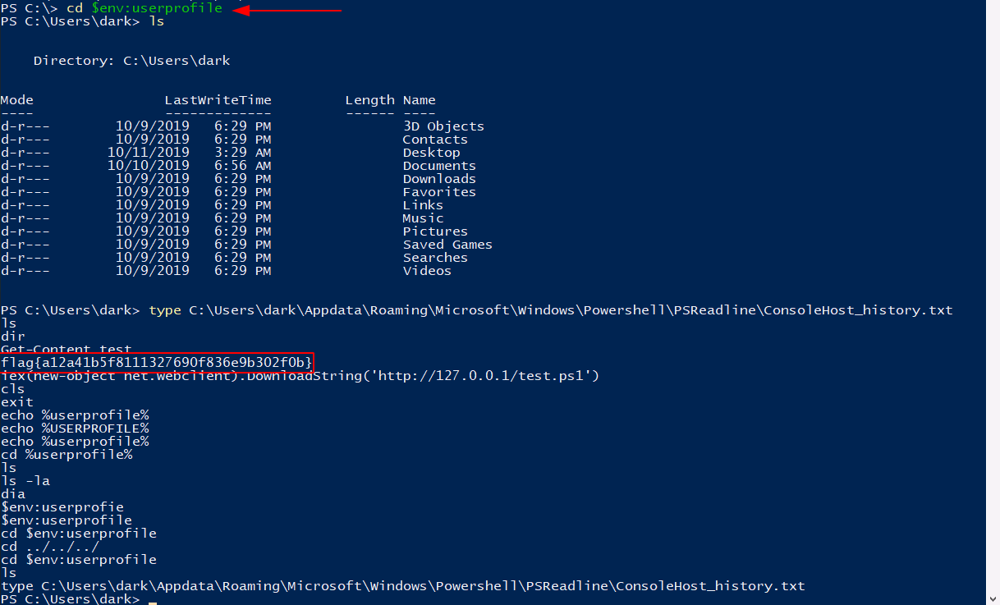
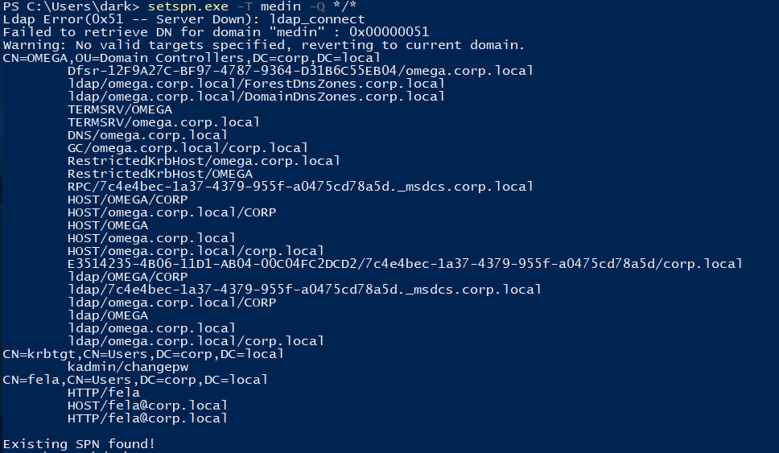
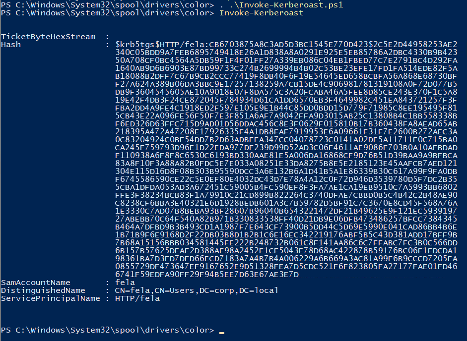
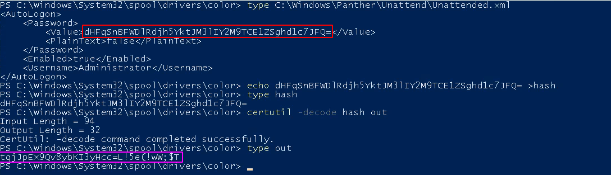
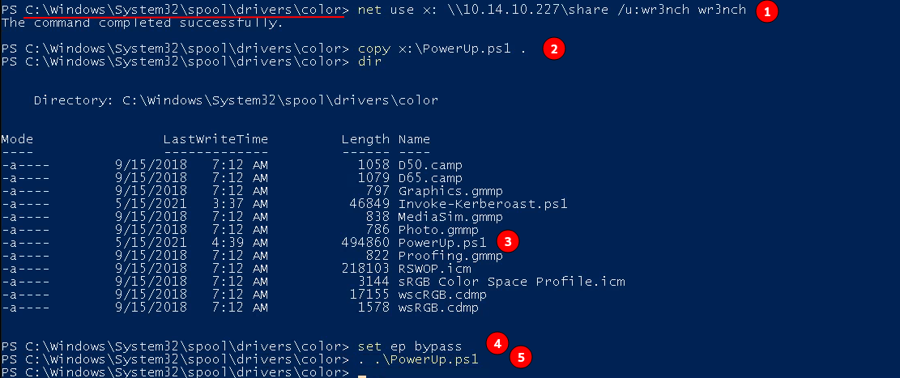
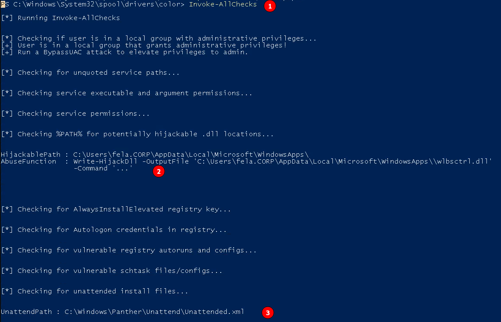

# Corp

## Bypassing AppLocker

<p align="center">
  
</p>

- The Contents placed in `C:\Windows\System322\spool\drivers\color` is always whitelisted by the Applocker with default settings
- The history of commands executed can be found in `$env:userprofile\Appdata\Roaming\Microsoft\Windows\Powershell\PSReadline\consoleHost_history.txt`

## Kerberoasting

<p align="center">
  
</p>

- Running that command, we find an existing SPN. What user is that for?
`fela`

<p align="center">
  
</p>

- Crack the hash. What is the users password in plain text?
`rubenF124`

- Login as this user. What is his flag?
`flag{bde1642535aa396d2439d86fe54a36e4}`

## Privilege Escalation

<p align="center">
  
</p>

- Sharing the powerup.ps1 via smb

<p align="center">
  
</p>

```bash
# steps
1 - mount the smb share with username and password
2 - copy powerup.ps1 from the share to the machine
3 - set execution policy to bypass
4 - Import the module
```

- Running all security checks with powerup.ps1

<p align='center'>
  
</p>

```bash
# steps
1 - After import the module, we issue the command, `Invoke-AllChecks`
2 - The DLLHijacking path is shown by the powerup.ps1
3 - And the unatteded.xml path is enumerated
```

- What is the decoded password?
`tqjJpEX9Qv8ybKI3yHcc=L!5e(!wW;​ $T `

- Now we have the Administrator's password, login as them and obtain the last flag.
`THM{g00d_j0b_SYS4DM1n_M4s73R}`
