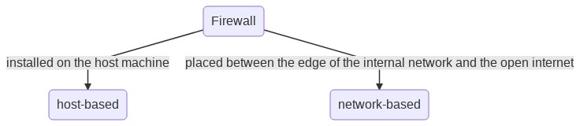
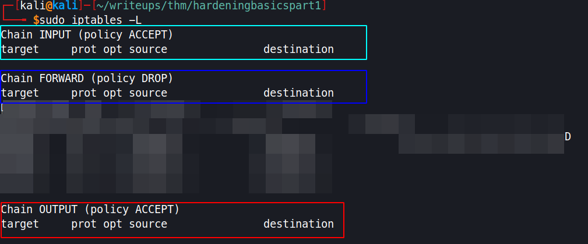

# Hardening Basics Part 1


## SUDO

- Stands for `Super User Doer`
- Allows non root user to run the application as root

```bash
# obtain the groups which the current user is a member of
groups

# add a user to a certain groups
usermod -aG {group name} {user name}

# obtain the permissions that the users can run as SUDO
sudo -l

# grant a user all to execute all application as root without password
{username} ALL=(ALL:ALL) ALL NOPASSWD: ALL

# disable root ssh login
 - change "PermitRootLogin" to "no"

# to avoid privesc using the text editors like vim, implement sudoedit
# in the sudoers file
{username} ALL=(ALL) sudoedit {filename}

# the requirements for password (password complexity) can be assigned with the help of pwquality pam module and configuring the pwquality.conf file in /etc/security
# install pwquality pam module
sudo apt-get install libpam-pwquality
# the default configuration can be found in /etc/pam.d/common-password
# this file specifies the no. of retries that can be done on event of wrong password
cat /etc/pam.d/common-password | grep pwquality
# in the /etc/security/pwquality.conf file we can specify the password complexity for the users

# password expiration can be configured within the "Password Aging Control" Section of /etc/login.defs
# Password aging controls:                                                                                      
#                        
#       PASS_MAX_DAYS   Maximum number of days a password may be used.
#       PASS_MIN_DAYS   Minimum number of days allowed between password changes.
#       PASS_WARN_AGE   Number of days warning given before a password expires.
#                                                                                                                                                     
PASS_MAX_DAYS   99999        
PASS_MIN_DAYS   0        
PASS_WARN_AGE  7
```

## Firewalls

> A Firewall by Cisco's definition is a "network security device that monitors incoming and outgoing network traffic and decides whether to allow or block specific traffic based on a defined set of security rules"

[CISCO](https://www.cisco.com/c/en/us/products/security/firewalls/what-is-a-firewall.html)

<p align="center">
  
</p>


- Iptables, on of the ways to interact with the **netfilter** which comes default with linux
- Uncomplicated Firewall (**ufw**) acts like a front-end for iptables comes with default in ubuntu

- Iptables have four components:
  - **Filter Table** -  offers the basic protection that you'd expect a firewall to provide
  - **Network Address Translation Table** - connects the public inter-webs to the private networks
  - **Mangle Table** - for mangling the packets as they go through the firewall
  - **Security table** - only used by SELinux

<p align="center">
  
</p>

- Chains description:
  - INPUT - packets coming into the firewall
  - FORWARD - packets routed to another NIC on the network; for packets on the local network that are being forwarded on.
  - OUTPUT - packets going out of the firewall

- To configure the iptables we would need rules (in security terms,its often termed as **Access Control List [ACL]**)
- Application like [Ansible](https://www.ansible.com/) could be used to distribute host-based Firewall rules to other hosts quickly and easily.

>  ACLs are read by the system from the top down.  Keep that in mind when reading the rules that we will add

```bash
# allow network traffic
# -A = Append to the input chain
# -m {module name} = uses the specified value
# --ctstate ESTABLISHED,RELATED: Available due to the previous flag/option set. Will keep track of connections which are already ESTABLISHED and RELATED. RELATED just means that it's new but part of another already established connection
# -j {ACTION} = accept / drop connection from the connection
sudo iptables -A INPUT -m conntrack --ctstate ESTABLISHED,RELATED -j ACCEPT

# accept connection by specifying ports
sudo iptables -A INPUT -p tcp --dport ssh -j ACCEPT

# deny connection to the port
sudo iptables -A INPUT -p tcp --dport smb -j DROP

# block all connections unless the connection rule is specified in the iptables
# final stage of configuring Iptables
sudo iptables -A INPUT -j DROP    

# save the created rules for iptables
sudo iptables-save
```


## Chapter 1 QUIZ

-  What group are users automatically added to in Ubuntu?
`sudo`

- What would be the command to add an existing user, nick, to the sudo group? You're running as root
`usermod -aG sudo nick`

- What command as a user can we enter to see what we are allowed to execute with sudo?
`sudo -l`

- Where is the sudo policy file stored?
`/etc/sudoers`

- When in visudo and you see %____, what does the % sign indicate that you are dealing with?
`group`

- This Alias lets the user assign a name, like "ADMINS" to a group of people
`user`

- Which Alias allows you to create a set of commands that you can then assign to a User Alias?
`command`

- Yey/Ney - emacs has a shell escape
`Yey`

- What is the minimum recommended password length set by NIST?
`8`

- When using the pwhistory module, which file will contain the previous passwords for the user?
`opasswd`

- What principle states that every user only has enough access to do their daily duties and tasks
`principle of least privilege`

## Chapter 2 QUIZ

-  This type of Firewall typically has two NIC cards
`Network-Based`

- This type of Firewall is typically installed on a host computer and rules apply to that specific host only
`Host-Based`

- Web Application Firewalls help add an extra layer of security to your web servers.  Where should these be installed?
`Demilitarized zone`

- iptables is not the name of the Linux Firewall.  What is the framework that iptables allows us to interact with?
`netfilter`

- This 3 letter acronym is a set of rules that defines what the Firewall should allow and what it should deny
`ACL`

- Which iptables option allows us to keep track of the connection state?
`--ctstate`

- Which iptable Chain is responsible for packets on the local network that are being carried onwards?
`Forward`

- Which table mashes up the packets as they go through the Firewall?
`Mangle`

- What is the last rule that should be added to an access control list?
`implicit deny`
