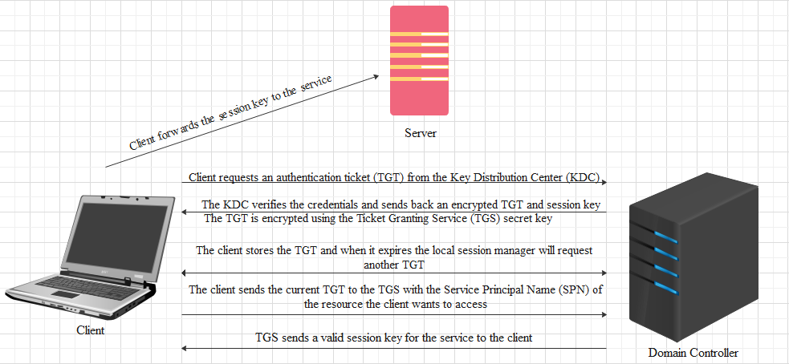
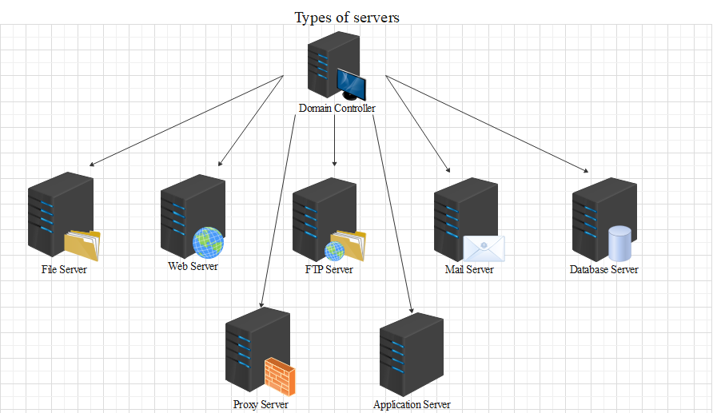

# Intro to Windows

## A little history

-  When was Windows announced?
`November 20 1985`

- Which is the latest version of Windows?
`Windows 10`

- Which is the latest version of Windows Server?
`Windows Server 2019`

## Windows file system and permissions explained

<p align="center">
  
</p>

```bash
icacls = lists the permissions of the file
I - permission inherited from the parent container
F - full access (full control)
M - Modify right/access
OI - object inherit
IO - inherit only
CI - container inherit
RX - read and execute
AD - append data (add subdirectories)
WD - write data and add files
```

- In which folder are users profiles stored?
`Users`

## Understanding the authentication process

<p align="center">
  
</p>

- Which Active Directory is cloud based?
`Azure Active Directory`

- Which authentication method does not provide data integrity?
`NTLM`

-  Which authentication method assigns a ticket in order for a user to login?
`Kerberos`

- Which authentication method allow users to access applications with a single login (short name)?
`SAML`

- Authentication method that uses JSON Web Tokens?
`OpenID Connect`

## Types of servers

<p align='center'>
  
</p>

-  Which can be considered the most important server?
`Domain Controller`

- Which server can store emails?
`Mail Server`
