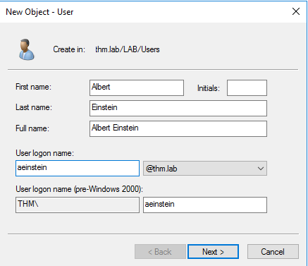
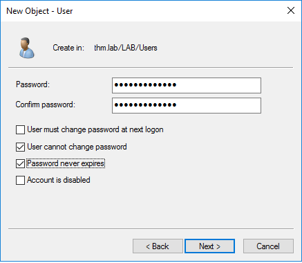
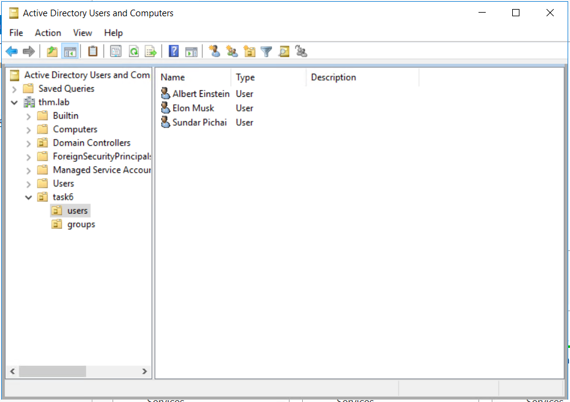
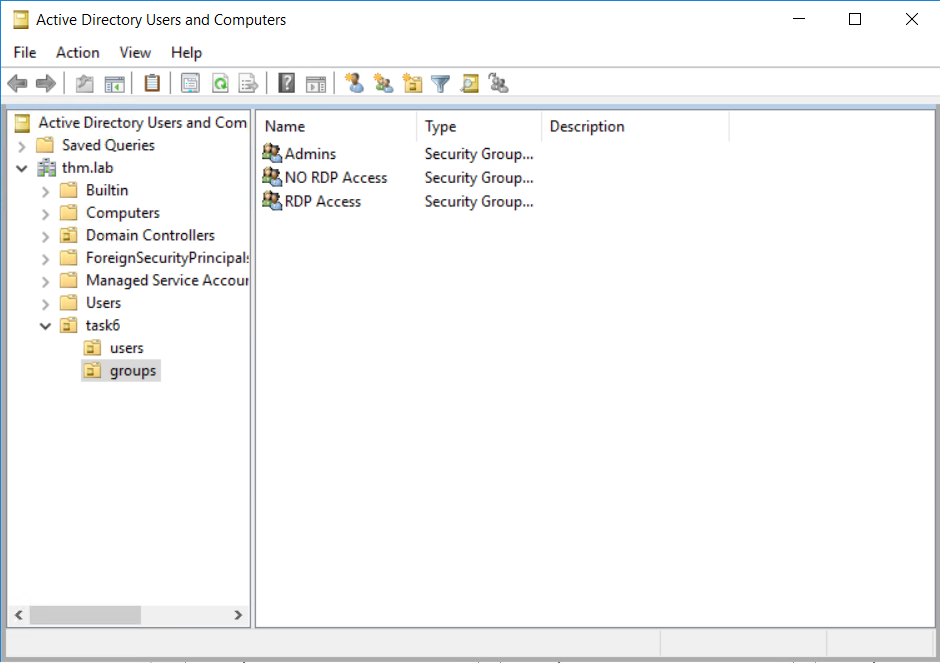
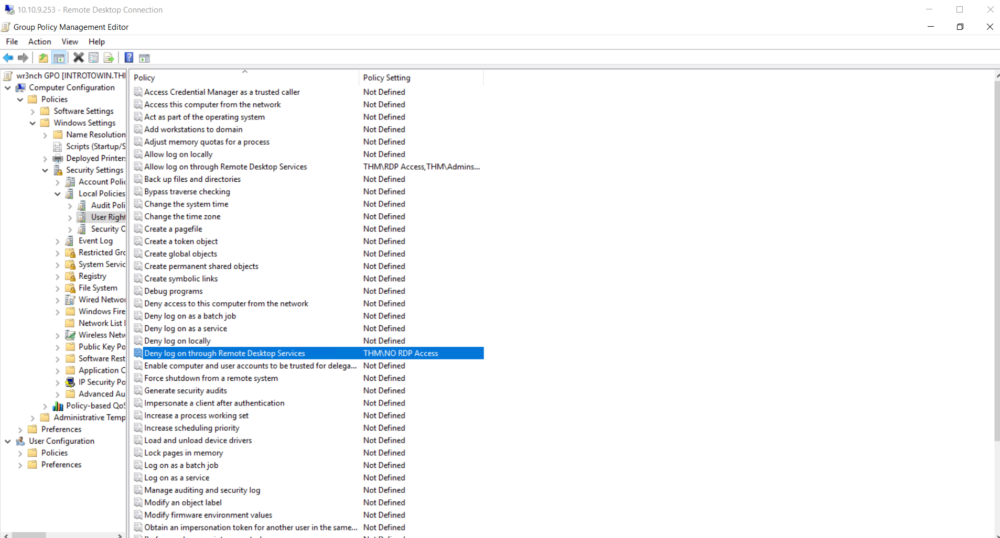

# Intro to Windows

<style>
  .hit{ display: block; margin: auto;}

  .box {
      width:relative;
      display: block;
      text-align:center; /* center align the text inside the box */
      margin:relative; /* center this .box element, assuming it is block-level */
  }

  .boxed{
      margin-left: 20px;
      margin-right: 20px;
      text-align:center;
      position: relative;
  }
</style>

## A little history

-  When was Windows announced?
`November 20 1985`

- Which is the latest version of Windows?
`Windows 10`

- Which is the latest version of Windows Server?
`Windows Server 2019`

## Windows file system and permissions explained


```bash
icacls = lists the permissions of the file
I - permission inherited from the parent container
F - full access (full control)
M - Modify right/access
OI - object inherit
IO - inherit only
CI - container inherit
RX - read and execute
AD - append data (add subdirectories)
WD - write data and add files
```

- In which folder are users profiles stored?
`Users`

## Understanding the authentication process


- Which Active Directory is cloud based?
`Azure Active Directory`

- Which authentication method does not provide data integrity?
`NTLM`

-  Which authentication method assigns a ticket in order for a user to login?
`Kerberos`

- Which authentication method allow users to access applications with a single login (short name)?
`SAML`

- Authentication method that uses JSON Web Tokens?
`OpenID Connect`

## Types of servers


-  Which can be considered the most important server?
`Domain Controller`

- Which server can store emails?
`Mail Server`


## Users and Group Management

> FOR SOME REASON xfreerdp and remmina failed to connect to RDP I had to connect to the RDP via Windows

- To create a new active direcory user, go to **Tools** --> **Active Directory Users and Computers**
- A new window will be prompted
- Right click on the domain (has the computer network icon which looks like rook)
- First Create an **Organizational Unit** which will be in the nested format for easier Management
- Right click on the domain **New** --> **Organizational Unit**
- Name the created Organizational unit as you wish, I created the Organizational unit as **task6**
- Now for the time to create users and groups Organizational Unit
- Right click on the Organizational unit created in the domain (*task6*) and again create two new Organizational units and name them as **users** and **groups** respectively
- Now to add users to the newly created users Organizational unit
- Right click on the Users Organizational unit under the task6 Organizational unit and click **New** --> **User**
- Now name fill up the users information and password to create a user


<div class="box">
  
  
</div>

- Now a user albert Enistein is created
- Now repeat the same process to create 2 more users



- Now right click on the previously created Organizational unit name **groups**
- Create a group: RIght click on groups Organizational unit --> **New** --> **Group**
- Fillup the group name and the groups are created, create 3 groups



- Add the users to the group, right click on the user add to group and browse the group name
- Now its time to specify the permissions for the groups, which will be applied to the members of the group
- To specify the permissions for a group navigate to Group Policy Management from Server Management
- **Server Management** --> **Tools** --> **Group Policy management**
- In the Group Policy Management window, create a new policy with the name you desire (I named as wr3nchGPO)
- Now right click on the created policy and choose **edit** option
- To specify the permissions for users navigate to **Users Right Assignment**
- **wr3nchGPO** --> **Computer Configuration** --> **Policies** --> **Window Settings** --> **Security Settings** --> **Local Policies** --> **User Right Assignments**
- Here a bunch of permissions can be seen
- Lets allow RDP access to the users beloning to the RDP Access group
- **Allow log on through Remote Desktop Services** --> **Define these policy settings** --> **Add users or group** --> **Browse**



- Add the groups and exit it
- Now apply the newly created Group Policy
- Navigate to the Group Policy Management windows and apply the created policy on the domain to apply the permissions set by us
- Fin
