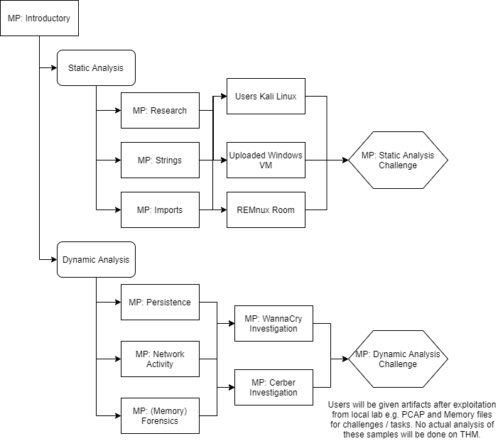
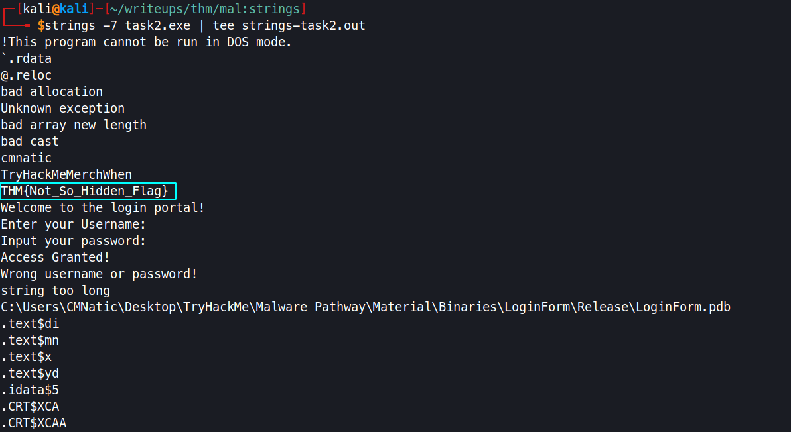

# MAL: Strings

<p align="center">

</p>

- Strings:
  - In Programming: A datatype to store values
  - In general: A value to store alphanumeric values
- To anlayze the strings present in the application, we make use of the utility available in linux called as `strings`

```bash
# obtains all the strings from the binary
strings {binary}

# obtain string with specific no. of starting length
# strings -n {binary}
strings -7 {binary} # obtains only strings which has the length starting from 7
```

<p align="center">
  
</p>


## Practical: Extracting "strings" From an Application

- What is the correct username required by the "LoginForm"?
`cmnatic`

- What is the required password to authenticate with?
`TryHackMeMerchWhen`

- What is the "hidden" THM{} flag?
`THM{Not_So_Hidden_Flag}`

## Strings in the Context of malware

- What is the key term to describe a server that Botnets recieve instructions from?
`Command and Control` (often reffered as C2/C2C)

- Name the discussed example malware that uses "strings" to store the bitcoin wallet addresses for payment
`wannacry`

##  Practical: Finding Bitcoin Addresses in Ransomware (Deploy)

- List the number of total transactions that the Bitcoin wallet used by the "Wannacry" author(s)
`142`

- What is the Bitcoin Address stored within "ComplexCalculator.exe"
`1LVB65imeojrgC3JPZGBwWhK1BdVZ2vYNC`

## Summary

- What is the name of the toolset provided by Microsoft that allows you to extract the "strings" of an application?
`sysinternal`

- What operator would you use to "pipe" or store the output of the strings command?
`>`

- What is the name of the currency that ransomware often uses for payment?
`bitcoin`

### Reference

- Monitor bitcoin transac with bitcoin valut address using [blockcypher](https://live.blockcypher.com/)
