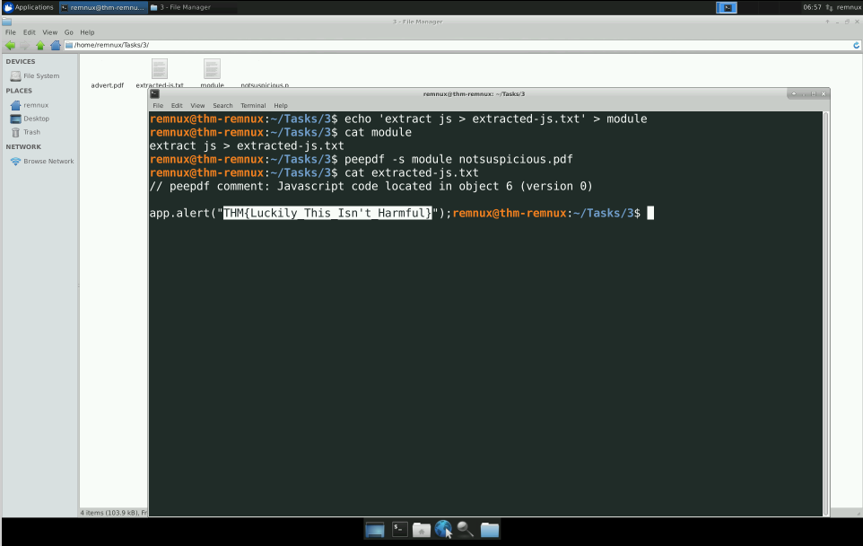
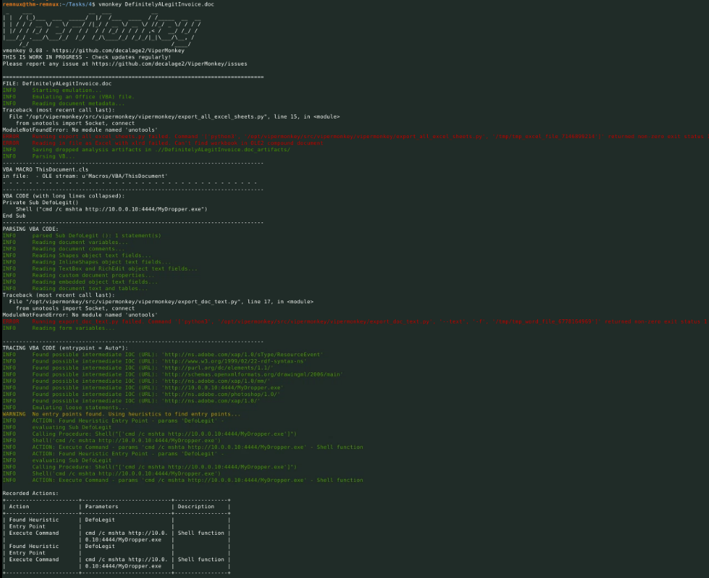
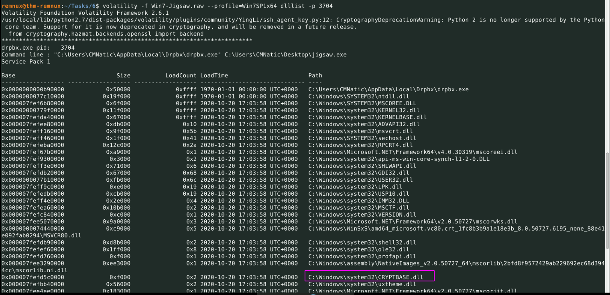

# REMnux

## Tools

| Tools | Description |
|-------|-------------|
|<a name="pjs">`peepdf`</a> | Used to determine the presence of Js in PDF and exetract it without executing |
|<a name="vm">`vmonkey`</a> | Used to analyze the .doc files |
|<a name="vol">`volatility`</a> | Used to inspect image files memory dump |


## Usage

### Extract  javascript from PDF <a name='pjs'></a>

<p align="center">
  
</p>


```bash
1 - Create a file, specifying the extract module from the peepdf and store it

echo 'extract js > extracted-js.txt' > module

2 - We now need to tell peepdf the name of the script (extracted_javascript.txt) and the PDF file that we want to extract from (demo_notsuspicious.pdf):

peepdf -s module demo_notsuspicious.pdf

3 - Display the js content

cat extracted-js.txt
```

### Look for embeded files in a DOC file <a name="vm"></a>

<p align="center">
  
</p>

```bash
1 - Load the file to the vmonkey

2 - Analyze the output
```

### Inspecting a memory dump

<p align="center">
  
</p>

```bash
1 - Load the file to volatility
volatility -f 'memory dump'

2 - List the processes that were running during the time of dump
volatility -f 'memory dump' --profiles="{analyzed value}" pslist

3 - List the dlls used by a specific application
volatility -f 'memory dump' --profiles="{analyzed value}" dlllist -p "{process id from pslist}"
```

## Analyzing Malicious PDF's

-  How many types of categories of "Suspicious elements" are there in "notsuspicious.pdf"
`3`

- Use peepdf to extract the javascript from "notsuspicious.pdf". What is the flag?
`THM{Luckily_This_Isn't_Harmful}`

- How many types of categories of "Suspicious elements" are there in "advert.pdf"
`6`

- Now use peepdf to extract the javascript from "advert.pdf". What is the value of "cName"?
`notsuspicious`

## Analysing Malicious Microsoft Office Macros

-  What is the name of the Macro for "DefinitelyALegitInvoice.doc"
`DefoLegit`

- What is the URL the Macro in "Taxes2020.doc" would try to launch?
`http://tryhackme.com/notac2server.sh`

## I hope you packed your bags

-  What is the highest file entropy a file can have?
`8`

- What is the lowest file entropy a file can have?
`0`

- Name a common packer that can be used for applications?
`UPX`
