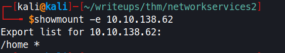
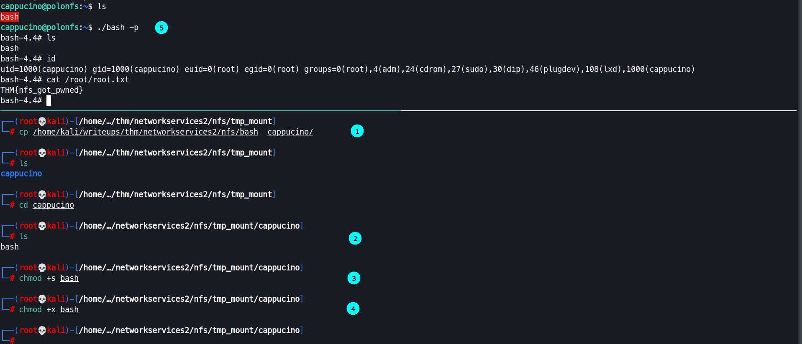
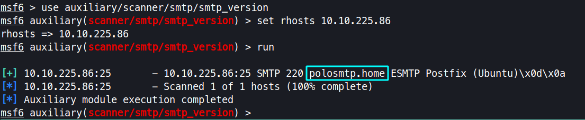
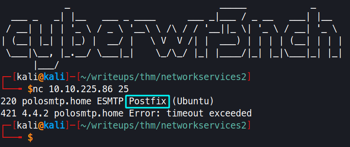
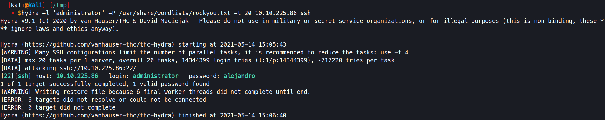
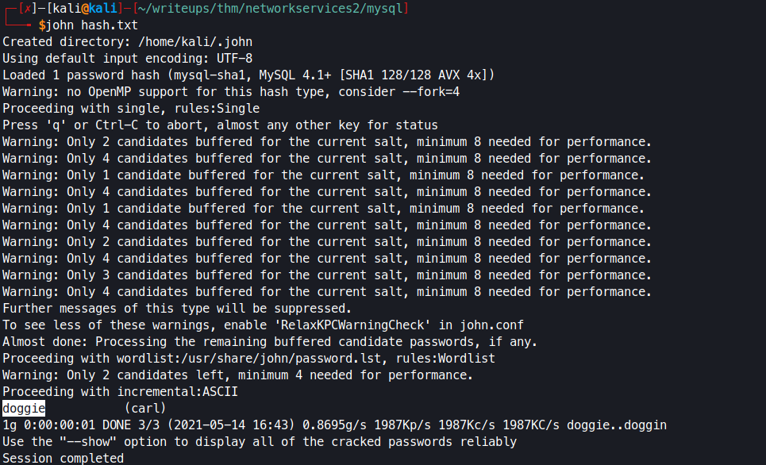

# Network Services 2

## Understanding NFS

- What does NFS stand for?
`Network File System`

- What process allows an NFS client to interact with a remote directory as though it was a physical device?
`Mounting`

- What does NFS use to represent files and directories on the server?
`File Handle`

- What protocol does NFS use to communicate between the server and client?
`RPC`

- What two pieces of user data does the NFS server take as parameters for controlling user permissions? Format: parameter 1 / parameter 2
`User id / group id`

- Can a Windows NFS server share files with a Linux client? (Y/N)
`Y`

- Can a Linux NFS server share files with a MacOS client? (Y/N)
`Y`

- What is the latest version of NFS? [released in 2016, but is still up to date as of 2020] This will require external research.
`4.2`


## Enumerating NFS

<p align="center">
	
</p>

- Conduct a thorough port scan scan of your choosing, how many ports are open?
`7`

- Which port contains the service we're looking to enumerate?
`2049 (nfs_acl)`

- Now, use /usr/sbin/showmount -e [IP] to list the NFS shares, what is the name of the visible share?
`/home`

- Then, use the mount command we broke down earlier to mount the NFS share to your local machine. Change directory to where you mounted the share- what is the name of the folder inside?
`cappucino`

- Interesting! Let's do a bit of research now, have a look through the folders. Which of these folders could contain keys that would give us remote access to the server?
`.ssh`

- Which of these keys is most useful to us?
`id_rsa`

- Can we log into the machine using ssh -i <key-file> <username>@<ip> ? (Y/N)
`Y`

## Exploiting NFS

<p align="center">
	
</p>

-
Now, we're going to add the SUID bit permission to the bash executable we just copied to the share using "sudo chmod +[permission] bash". What letter do we use to set the SUID bit set using chmod?
`s`

-  Let's do a sanity check, let's check the permissions of the "bash" executable using "ls -la bash". What does the permission set look like? Make sure that it ends with -sr-x.
`-rwsr-sr-x`

- Great! If all's gone well you should have a shell as root! What's the root flag?
`THM{nfs_got_pwned}`

## Understanding SMTP

- What does SMTP stand for?
`Simple Mail Transfer protocol`

- What does SMTP handle the sending of?
`email`

- What is the first step in the SMTP process?
`smtp handshake`

-  What is the default SMTP port?
`25`

- Where does the SMTP server send the email if the recipient's server is not available?
`smtp queue`

-  On what server does the Email ultimately end up on?
`POP/IMAP3`

- Can a Linux machine run an SMTP server? (Y/N)
`Y`

- Can a Windows machine run an SMTP server? (Y/N)
`Y`

## Enumerating SMTP

- First, lets run a port scan against the target machine, same as last time. What port is SMTP running on?
`25`

- Okay, now we know what port we should be targeting, let's start up Metasploit. What command do we use to do this?
`msfconsole`

-  Let's search for the module "smtp_version", what's it's full module name?
`auxiliary/scanner/smtp/smtp_version `

- Great, now- select the module and list the options. How do we do this?
`options`

- Have a look through the options, does everything seem correct? What is the option we need to set?
`rhosts`

<p align="center">
	
</p>

- Set that to the correct value for your target machine. Then run the exploit. What's the system mail name?
```bash
# can be enumerated in 3 ways nc, nmap and msf - image location smtp/smtp-name-*
polosmtp.home
```

<p align="center">
	

- What Mail Transfer Agent (MTA) is running the SMTP server? This will require some external research.
`Posix`

-  Good! We've now got a good amount of information on the target system to move onto the next stage. Let's search for the module "smtp_enum", what's it's full module name?
`auxiliary/scanner/smtp/smtp_enum`

- What option do we need to set to the wordlist's path?
`USER_FILE`

- Once we've set this option, what is the other essential paramater we need to set?
`rhosts`

- Okay! Now that's finished, what username is returned?
`administrator`

## Exploiting SMTP

<p align="center">
	
	</p>

- What is the password of the user we found during our enumeration stage?
`alejandro`

- Great! Now, let's SSH into the server as the user, what is contents of smtp.txt
`THM{who_knew_email_servers_were_c00l?}`

## Understanding MYSQL

- What type of software is MySQL?
`Relational Database Management System`

- What language is MySQL based on?
`SQL`

- What communication model does MySQL use?
`Client-Server`

- What is a common application of MySQL?
`backend database`

- What major social network uses MySQL as their back-end database? This will require further research.
`facebook`

## Enumerating MYSQL

-  As always, let's start out with a port scan, so we know what port the service we're trying to attack is running on. What port is MySQL using?
`3306`

-  Search for, select and list the options it needs. What three options do we need to set? (in descending order).
`password/rhosts/username`

- Run the exploit. By default it will test with the "select version()" command, what result does this give you?
`5.7.29-0ubuntu0.18.04.1`

## Exploiting MYSQL

<p align="center">
	
</p>

- First, let's search for and select the "mysql_schemadump" module. What's the module's full name?
`auxiliary/scanner/mysql/mysql_schemadump`

-  Great! Now, you've done this a few times by now so I'll let you take it from here. Set the relevant options, run the exploit. What's the name of the last table that gets dumped?
`x$waits_global_by_latency`

-  Awesome, you have now dumped the tables, and column names of the whole database. But we can do one better... search for and select the "mysql_hashdump" module. What's the module's full name?
`auxiliary/scanner/mysql/mysql_hashdump`

- Again, I'll let you take it from here. Set the relevant options, run the exploit. What non-default user stands out to you?
`carl`

- What is the user/hash combination string?
`carl:*EA031893AA21444B170FC2162A56978B8CEECE18`

- Now, we need to crack the password! Let's try John the Ripper against it using: "john hash.txt" what is the password of the user we found?
`doggie`

- What's the contents of MySQL.txt
`THM{congratulations_you_got_the_mySQL_flag}`
